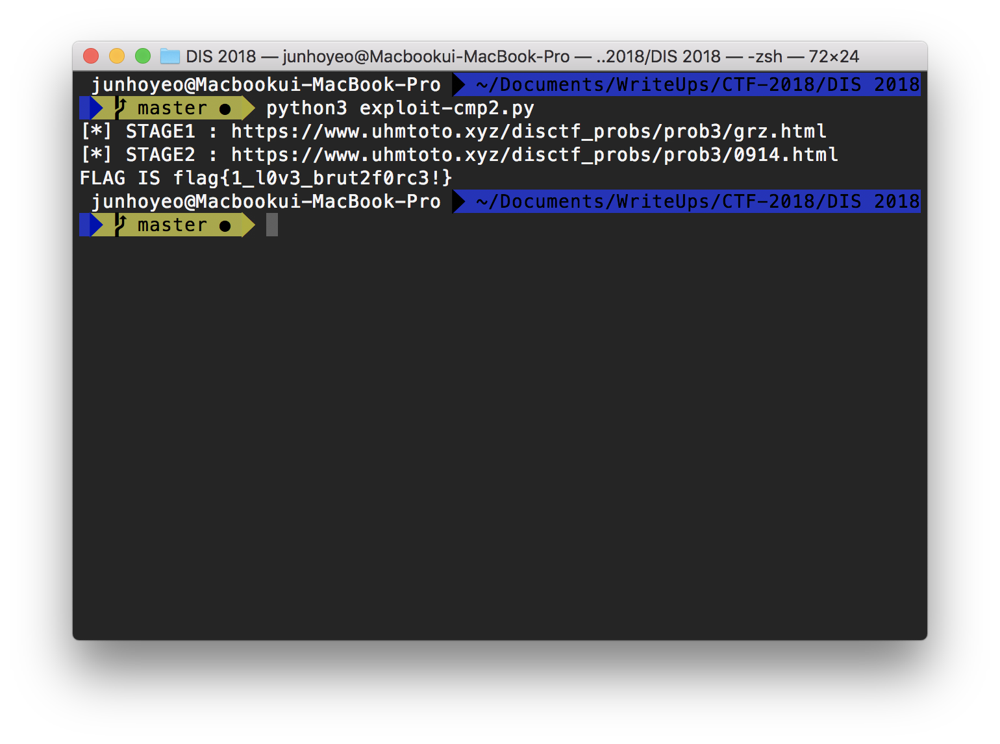

# DIS 2018 - We_Are_From_SWU (2st, 6714)


With @uhmtoto, @cokia, @gtg7784

2018.07.21

## Probs


> 롸업이 작성된 문제는 취소선을 그어주세요

- CRYPTOGRAPHY
    - ~~[x] Canada : 7Jqw66as64KY6528IOyXreyCrCDsho0g66qo65OgIOuCmOudvOydmCDqsbTqta3sl7Drj4Trpbwg642U7ZWY7Iuc7Jik~~
    - [ ] UK : N0oyOC8ldUI0RjEvZHAvJXVBQzAwLzZybWQvc2wvUHc9PQ==
    - [x] Zambia : dks7sud6gk8tp1dy7g6==
    - [ ] Tanzania : Mixed!

- FOR NEWBIE!
    - [x] Guatemala : C....
    - [x] Brazil : SuperDuper!
    - [x] Mauritania : Over...
    - [x] Angola : The kernel?
    - [x] Yemen : Firewall?
    - [x] China : Interpreter?
    - [x] Malaysia : What is it?

- FORENSIC
    - [x] Ukraine : CERTCERTCERT

- MISC
    - [x] Argentina : Compare!
    - [x] Germany : How many languages do you know?
    - [ ] Sudan : NOGADADA

- NETWORK
    - [x] Chad : Network 2
    - [x] Mongolia : network3

- NONE ~~맛소금드립~~
    - ~~[x] Mexico : ethereum~~
    - ~~[x] Czech : Old Version..? Old Version?~~

- REVERSING
    - [x] Russia : EZ_REVERSING
    - ~~[x] Spain : REVERGRAPHY~~
    - [ ] Australia - Reversing Problem

- WEB
    - [x] Greenland : EZ_wb1
    - ~~[x] US : comment~~
    - ~~[x] Argentina : Compare!~~
    - ~~[x] Burkina Faso : Another WEb?~~
    - ~~[x] Algeria : cmp2~~
    - ~~[x] Libya : Can you be the GOD? 😀~~
    - ~~[x] Congo : Key Auth~~
    - ~~[x] Kyrgyzstan : YEOEY~~

-----

## CRYPTOGRAPHY

### Canada : 7Jqw66as64KY6528IOyXreyCrCDsho0g66qo65OgIOuCmOudvOydmCDqsbTqta3sl7Drj4Trpbwg642U7ZWY7Iuc7Jik
```python
>>> import base64
>>> base64.b64decode('7Jqw66as64KY6528IOyXreyCrCDsho0g66qo65OgIOuCmOudvOydmCDqsbTqta3sl7Drj4Trpbwg642U7ZWY7Iuc7Jik').decode().replace(' ', '_')
'우리나라_역사_속_모든_나라의_건국연도를_더하시오'
```

부들,,,부들

`우리나라_역사_속_모든_나라의_건국연도를_더하시오`

### Zambia : dks7sud6gk8tp1dy7g6==

-----

## FOR NEWBIE!

### Guatemala : C....

### Brazil : SuperDuper!

### Mauritania : Over...

### Angola : The kernel?

### Yemen : Firewall?

### China : Interpreter?

### Malaysia : What is it?

-----

## FORENSIC

### Ukraine : CERTCERTCERT

-----

## MISC

### Argentina : Compare!

### Germany : How many languages do you know?

-----

## NETWORK

### Chad : Network 2

### Mongolia : network3

-----

## NONE

### Mexico : ethereum
```
ETH * 4 =?
(Flag is Korean)
```

`이더넷`

### Czech : Old Version..? Old Version?
```
오래된 버전의 도커를 쓰면?
오래된 버전의 도커를 쓰면?
```

비교적 최근에 나옸는데 있어서 놀랐다.

`독거노인`

-----

## REVERSING

### Russia : EZ_REVERSING

### Spain : REVERGRAPHY
https://github.com/JunhoYeo/for-dis-2018#problem-one-revergraphy-spain

`sendMe_ETH_0x07B8CedbE8Ab83F06DFAdC39991910A4544dE3A1`

-----

### WEB

### Greenland : EZ_wb1

### US : comment
https://github.com/uhmtoto/Write-Up/blob/master/DIS%20CTF%202018%20%EB%82%B4%EA%B0%80%EB%82%B8%20%EB%AC%B8%EC%A0%9C%EB%93%A4%20WRITE-UP%5Bpdf%5D.pdf

`!!!th1s_is_last_prob!!!`

### Argentina : Compare!
https://github.com/uhmtoto/Write-Up/blob/master/DIS%20CTF%202018%20%EB%82%B4%EA%B0%80%EB%82%B8%20%EB%AC%B8%EC%A0%9C%EB%93%A4%20WRITE-UP%5Bpdf%5D.pdf

`MD5_cndehf`

### Burkina Faso : Another WEb?
https://github.com/JunhoYeo/for-dis-2018#problem-two-another-web-burkina-faso

`I_us3_k1ng_G0d_l4n9_PHP_so_$ME!=="AHSSA"?????`

### Algeria : cmp2
https://github.com/uhmtoto/Write-Up/blob/master/DIS%20CTF%202018%20%EB%82%B4%EA%B0%80%EB%82%B8%20%EB%AC%B8%EC%A0%9C%EB%93%A4%20WRITE-UP%5Bpdf%5D.pdf



심심해서 [징그럽게 숏코딩된 익스플로잇](./exploit-cmp2.py)을 짜봤다.

`1_l0v3_brut2f0rc3`

### Libya : Can you be the GOD? 😀
https://github.com/uhmtoto/Write-Up/blob/master/DIS%20CTF%202018%20%EB%82%B4%EA%B0%80%EB%82%B8%20%EB%AC%B8%EC%A0%9C%EB%93%A4%20WRITE-UP%5Bpdf%5D.pdf

`u_aR3_r2a1_G0d!`

### Congo : Key Auth
https://github.com/uhmtoto/Write-Up/blob/master/DIS%20CTF%202018%20%EB%82%B4%EA%B0%80%EB%82%B8%20%EB%AC%B8%EC%A0%9C%EB%93%A4%20WRITE-UP%5Bpdf%5D.pdf

`7J206rG466ee7LaU64uk64ulLg==`

### Kyrgyzstan : YEOEY
https://github.com/JunhoYeo/for-dis-2018#problem-sam-yeoey-kyrgyzstan

`S0E4SY,huh,,,i_am_so_kind_i_9uess`
