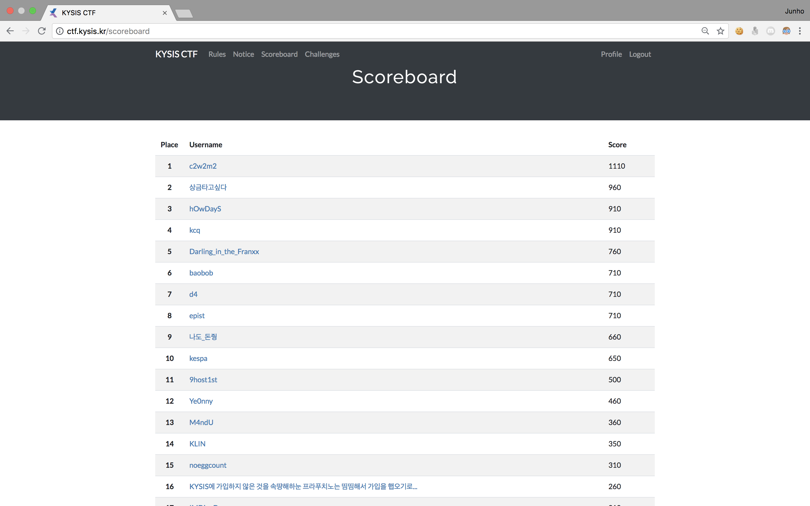
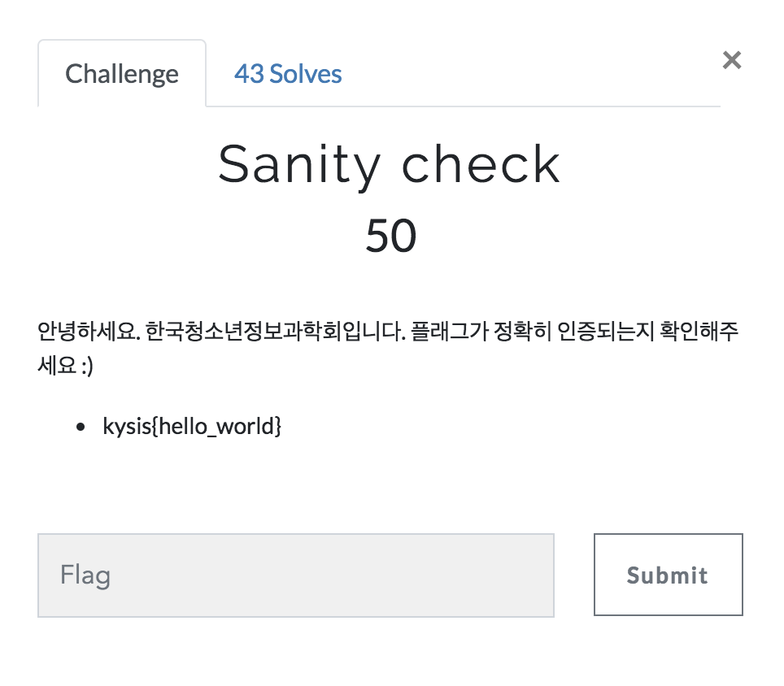
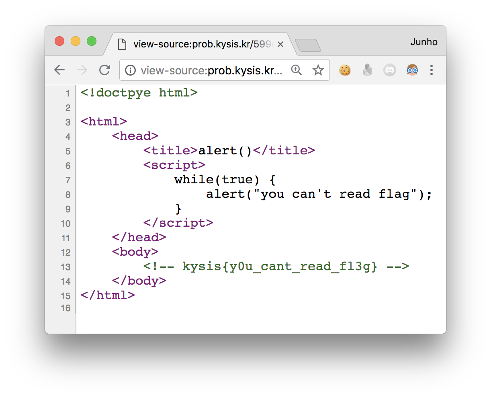
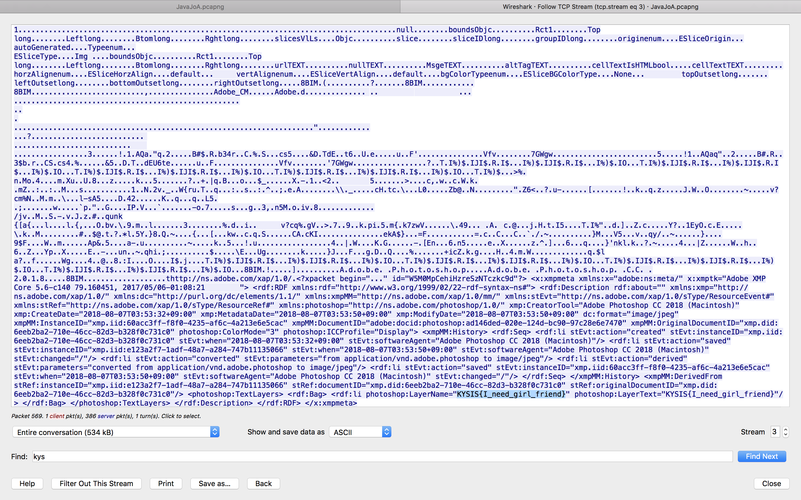
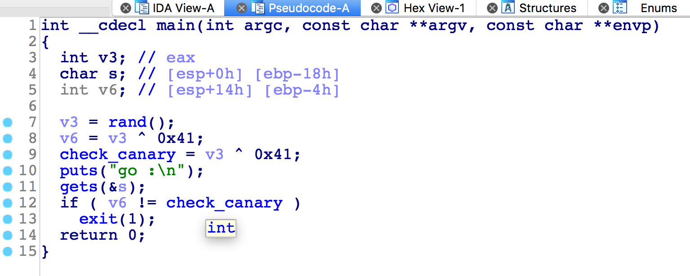
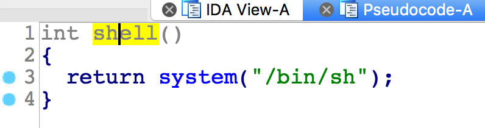
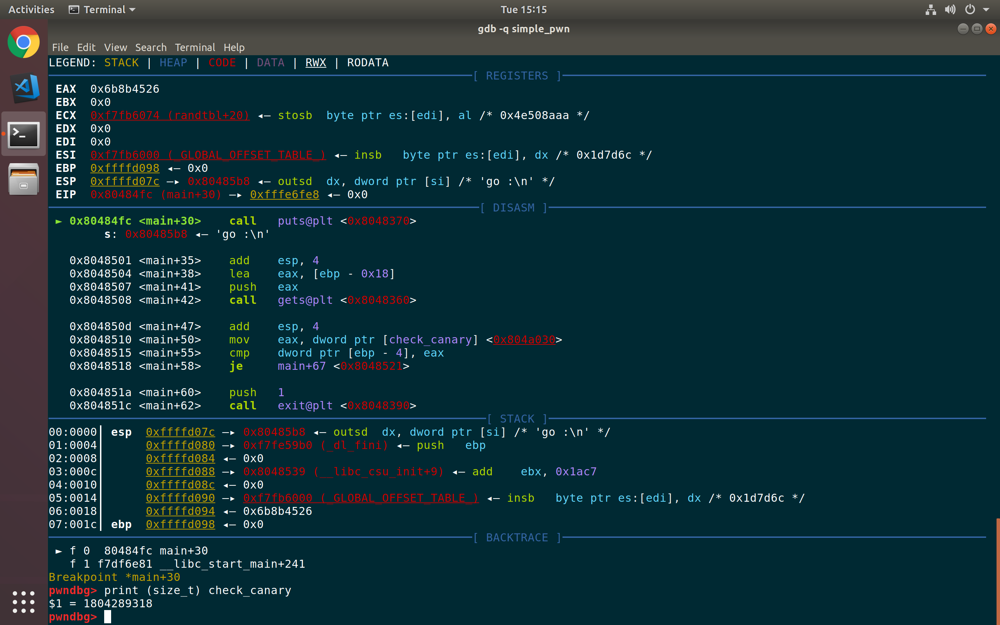
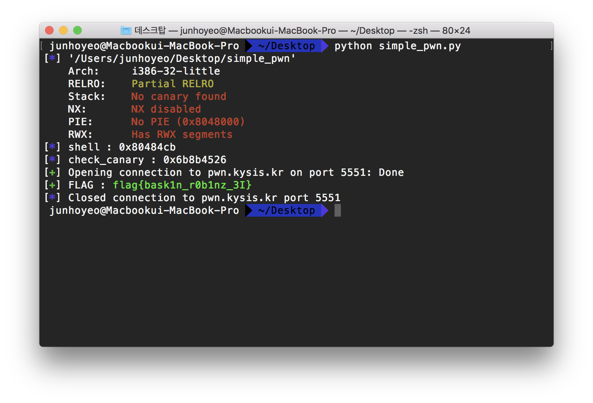
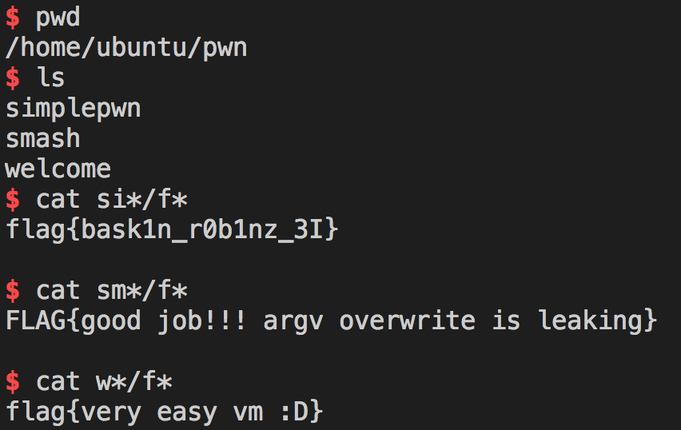

# KYSIS CTF - 프라푸치노 (16st, 260)

- 가입 당시 너무 피곤하고 정신없어서 재미삼아 닉네임에 안하던 짓을 했고 대회 댱일 급 후회했지만, 다행히 아무도 신경쓰지 않는 것 같아서 너무 다행스러웠다.

- 결국 `KYSIS에 가입하지 않은 것을 속땽해하눈 프라푸치노는 띰띰해서 가입을 햅오기로 해떠요 >< 쀼욤 이거 어디까지되나요`는 `해떠요`부터 스코어보드에서 짤렸다. 다행인지 불행인지 이를 클릭해서 개인별 프로필에 들어가면 닉네임 전체가 보여졌다. 

- ~~사실 나는 560점이다... 나는 560점이다... 나는 560점이다...~~(치명적 실수(?)는 후술)

- 그냥 아래 순서대로 쭉 풀었다.

## Sanity check (misc, 50)

걍 마이크테스트

`kysis{hello_world}`

## read flag (web, 50)
문제 사이트에 접속하면 자바스크립트 `alert()`가 뜬다.

링크 앞에 `view-source:`를 붙여주면 사이트 소스를 볼 수 있다.

물론 브라우저 설정에서 자바스크립트를 비활성화한다던가, 개발자 도구를 이용한다던가 하는 등의 다른 방법도 얼마든지 있다.

`kysis{y0u_cant_read_fl3g}`

## Net--Work (network, 60)
문제 내용이 기억은 안나지만...

- 자바를 좋아한다 어쩌고가 써있었던 것 같다.
- 이걸로 프로포즈를 한다고 했었다.

패킷을 주는데 `tcp.len>0`으로 필터링해서 보면 아래 같은 이미지 파일이 나온다.

누가 봐도 지민이가 만든 파일 같았는데 아니랬다. ~~아무래도 KYSIS에 보노보노 팬이 한 명 더 있는 것 같아!~~

해당 패킷에서부터 `follow TCP stream`을 쭉 하면 플래그가 나왔던 것으로 기억한다.

`KYSIS{I_need_girl_friend}`

앗, 아야.. 마음이 너무 아팠다.

## simple_pwn (pwnable, 100)
> 문제 서버가 준비중이여서 그냥 로컬에서 품 -> 공개되었다길래 다시 가보니 권한설정 오류 + 어떤 나쁜 시키가 디도스 날려서 다시 준비중 -> 다시 준비중 -> 다시... -> 흑흑... -> 밤 12시인가 몰컴하다가 서버 열림! -> 엄마한테 들킴 -> 자는 척 하다가 리모트로 풀어야지! -> 자버림 -> 내일 아침 6시 -> 리모트로 품 -> 실수로 잘못 침 -> 어?? 잠만? -> 포너블 플래그 다 얻음 -> 내적갈등 -> 제보 -> 양심지킴 -> 인증안함 -> 이불킥

IDA로 `main`을 뜯어보면 이렇게 `check_canary`라는 변수를 이용함을 알 수 있다. 그런데 `seed`를 설정하지 않아서 계속 똑같은 값이 나올 것이다.

`shell`이라는 함수도 있는데 `ret`을 여기 주소로 바꾸면 될 것 같다.

먼저 `check_canary` 값을 찾기 위해서 `gdb`를 이용했다. `1804289318`이였다.

`check_canary * offset + shell`을 넣는 것이 가장 안전해 보였다.

주소값 계산을 못해서 오프셋을 달리하면서 굴려보니([exploit.py](./exploit.py) 참고) `check_canary`를 7번 반복했을 때 `p.recv()`에서 `EOFError`가 안 뜨고 출력을 받으려고 계속 대기했다.

그래서 `p32(check_canary)*7 + p32(shell_addr)`를 보내니 쉘이 따졌다!

remote 역시 local exploit을 조금 수정하니 잘 됬다.

`flag{bask1n_r0b1nz_3I}`

## ??? ~~smashme (pwnable, 200), welcome_vm (pwnable, 100)~~

flag 파일들이 홈 폴더에 있는 게 아니라 `/home/ubuntu/pwn` 밑에 파일별로 있었는데 권한 설정이 잘못되었는지(분명히 전에 한 번 고쳤다고 들었는데ㅜㅜ) 다른 포너블 문제들의 flag들도 읽을 수 있었다.

와일드카드를 쓰다가 잘못된 flag를 읽게 되어서 발견했다. ~~그냥 인증해버릴껄ㅠㅠ...~~

`FLAG{good job!!! argv overwrite is leaking}`

`flag{very easy vm :D}`

걍 욕심을 버리자 ㅁㄴㅇㄹ ~~어차피 못풀었다~~
