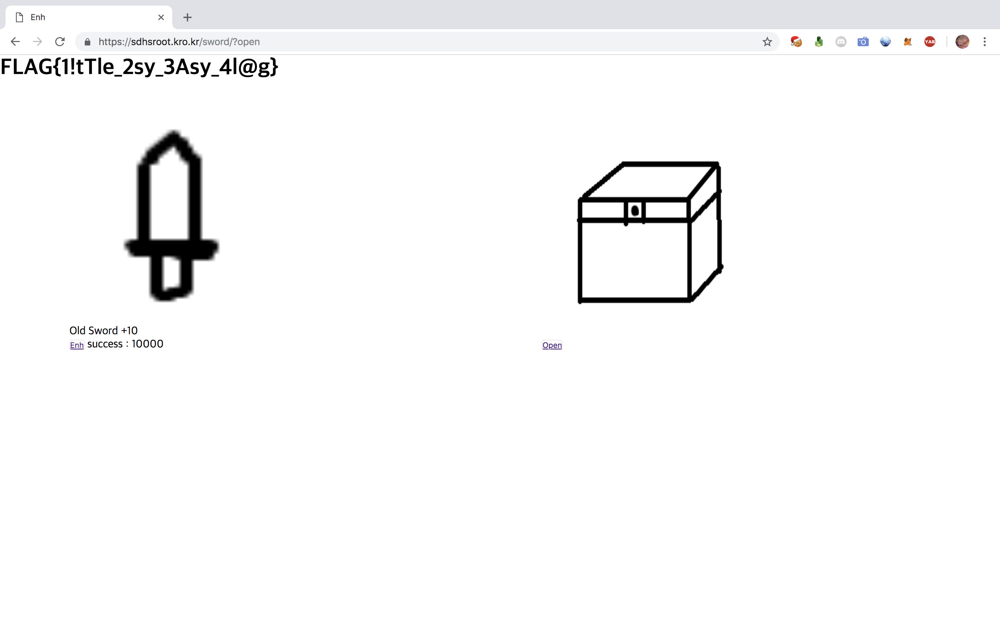

# mic drop
`FLAG{M1c..Dr0p..M1c..Dr0p..Welc0me_T0_R00T_CTF_2018!!}`

# secret chest
> Only +10 Sword can open it.

```js
function ganghua(){
    var lv = 10;
    sessionStorage.setItem("lv",lv);
    sessionStorage.setItem("suc",suc);
    document.getElementById("lv").innerHTML=lv;
    document.getElementById("suc").innerHTML=suc;
}
ganghua()
```



`FLAG{1!tTle_2sy_3Asy_4l@g}`

# hubgit

```
$ git reset --hard cc7611208282c863e4a9c09c821c8db124050898
HEAD is now at cc76112 FLAGFLAGFLAGFLAGFLAGFLAGFLAGFFFLLL@@@@@@@@GGGG
$ ls
MESSAGE README  flag
$ cat flag
FLAG{GIT_8rob1em_7h@t_C4n_b3_50lv3d_in_O63_M1nu7e!}
```

# findme
```
$ file FindMe\!.dmp 
FindMe!.dmp: MS Windows 64bit crash dump, full dump, 524158 pages
$ strings FindMe\!.dmp | grep 'FLAG{' >> output.txt
$ cat output.txt 
printf("FLAG{0h_You_Find_IT_!_!}\n");
FLAG{0h_You_Find_IT_!_!}
FLAG{0h_You_Find_IT_!_!}
!FLA"FLAG{0h_You_Find_IT_!_!}\n"
FLAG{0h_You_Find_IT_!_!}
"FLAG{0h_You_Find_IT_!_!}"
FLAG{0h_You_Find_IT_!_!}
"FLAG{0h_You_Find_IT_!_!}\n"
FLAG{0h_You_Find_IT_!_!}
"FLAG{0h_You_Find_IT_!_!}\n"
SITE_PIN_RULES_ALL_SUBDOMAINS_FLAG{
printf("FLAG{0h_You_Find_IT_!_!}\n");
FLAG{0h_You_Find_IT_!_!}
FLAG{0h_You_Find_IT_!_!}
printf("FLAG{0h_You_Find_IT_!_!}\n");
FLAG{0h_You_Find_IT_!_!}
"FLAG{0h_You_Find_IT_!_!}"
FLAG{0h_You_Find_IT_!_!}
"FLAG{0h_You_Find_IT_!_!}"
FLAG{0h_You_Find_IT_!_!}
"FLAG{0h_You_Find_IT_!_!}"
FLAG{0h_You_Find_IT_!_!}
"FLAG{0h_You_Find_IT_!_!}"
printf("FLAG{0h_You_Find_IT_!_!}\n");
printf("FLAG{0h_You_Find_IT_!_!}\n");
printf("FLAG{0h_You_Find_IT_!_!}\n");
FLAG{0h_You_Find_IT_!_!}
"FLAG{0h_You_Find_IT_!_!}"
FLAG{0h_You_Find_IT_!_!}
printf("FLAG{0h_You_Find_IT_!_!}\n");
FLAG{0h_You_Find_IT_!_!}
FLAG{0h_You_Find_IT_!_!}
FLAG{0h_You_Find_IT_!_!}
FLAG{0h_You_Find_IT_!_!}
"FLAG{0h_You_Find_IT_!_!}"
FLAG{0h_You_Find_IT_!_!}
"FLAG{0h_You_Find_IT_!_!}"
FLAG{0h_You_Find_IT_!_!}
"FLAG{0h_You_Find_IT_!_!}"
FLAG{0h_You_Find_IT_!_!}
"FLAG{0h_You_Find_IT_!_!}"
FLAG{0h_You_Find_IT_!_!}
FLAG{0h_You_Find_IT_!_!}
"FLAG{0h
printf("FLAG{0h_You_Find_IT_!_!}");
printf("FLAG{0h_You_Find_IT_!_!}\n");
printf("FLAG{0h_You_Find_IT_!_!}\n");
```

`FLAG{0h_You_Find_IT_!_!}`

풀고 12등에서 6등이 되었다.

# format 

```
$ exiftool Format.PNG 
ExifTool Version Number         : 11.23
File Name                       : Format.PNG
Directory                       : .
File Size                       : 5.7 kB
File Modification Date/Time     : 2018:12:22 01:34:56+09:00
File Access Date/Time           : 2018:12:22 13:05:59+09:00
File Inode Change Date/Time     : 2018:12:22 13:02:06+09:00
File Permissions                : rwxr-xr-x
File Type                       : PNG
File Type Extension             : png
MIME Type                       : image/png
Warning                         : Corrupted PNG image
```

```
$ pngcheck -v Format.PNG
File: Format.PNG (5788 bytes)
  chunk IHDR at offset 0x0000c, length 269488141:  EOF while reading data
ERRORS DETECTED in Format.PNG
```

