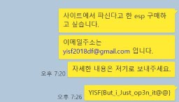
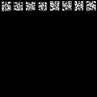

# YISF - 프라푸치노(150)

# forensics 50
```
접촉

게임핵 판매자를 찾아내기 위하여 최근 판매자와 접촉해서 핵을 구매한 것으로 보이는 구매 용의자를 찾아냈다. 하지만 지금 그는 판매자와 접촉한 적이 없다고 구매한 행위를 부인하고 있다. 구매자는 용의 주도한 성격이라 어딘가에 메모나 사진, 문서 등으로 기록했을 가능성이 있다. 하지만 조사팀에선 관련 파일을 찾지 못했고 당신에게 의뢰했다. 둘이 접촉한 증거를 찾아내어라.

이미지 파일 비밀번호
GoGoYISF2018_DigitalForensics_is_v3ry_Funny_You_C4n_g0_F1nal@@@@@

힌트1 : 썸네일
```



`YISF{But_i_Just_op3n_it@@}`

# forensics 100
```
상의

당신의 도움으로 판매자와 구매자가 접촉했다는 것을 확인했다. 이후에 둘은 거래를 하기 위해서 더 자세한 상의를 했을 것으로 보인다. 구매자는 이 과정에서 판매자로부터 파일을 받은 것으로 보인다. 그 파일의 내용을 확인하라.

힌트1 : eM Client
```

이메일 내용을 복구해서 읽어보면 PDF 파일을 전달받는 것을 알 수 있었는데 결국 파일을 찾지는 못했다.

# misc 50
```
notice

대회 규칙을 잘 지킵시다
```

대회 규칙을 보면서 문제를 풀면 플래그를 준다.

# misc 100
```
Advanced QR

진화한 QR코드, 작은 공간에 더 많은 정보를 담았습니다.
Hint 1 : LSB ~ MSB
Hint 2: RGB 그리고 2^8 == 256, 00000000 ~ 11111111
```


주어진 QR 코드를 살펴보니 각각의 픽셀에 대해서 RGB 값을 추출한 뒤 `(127, 127, 127)`보다 어두우면 검은색, 밝으면 흰색으로 칠하면 무언가 나올 것 같았다.


Python의 Image 모듈을 사용해서 위와 같은 방법으로 QR 코드를 추출하고 스캔하면 `Plz~~!!}`라는 문자열이 나온다. 아마 플래그의 뒷부분인 것 같다.



LSB 비트를 각각 추출해서 조합해 보면 위처럼 나온다.

# pwn 50
```
YISF_Lotto

부자가 되고 싶나?

힌트1: Format String Bug
힌트2: GOT Overwrite
힌트3: memset( )
```
