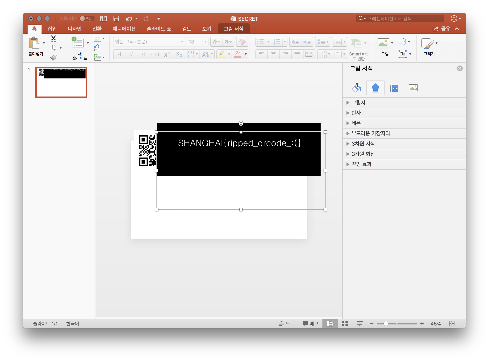
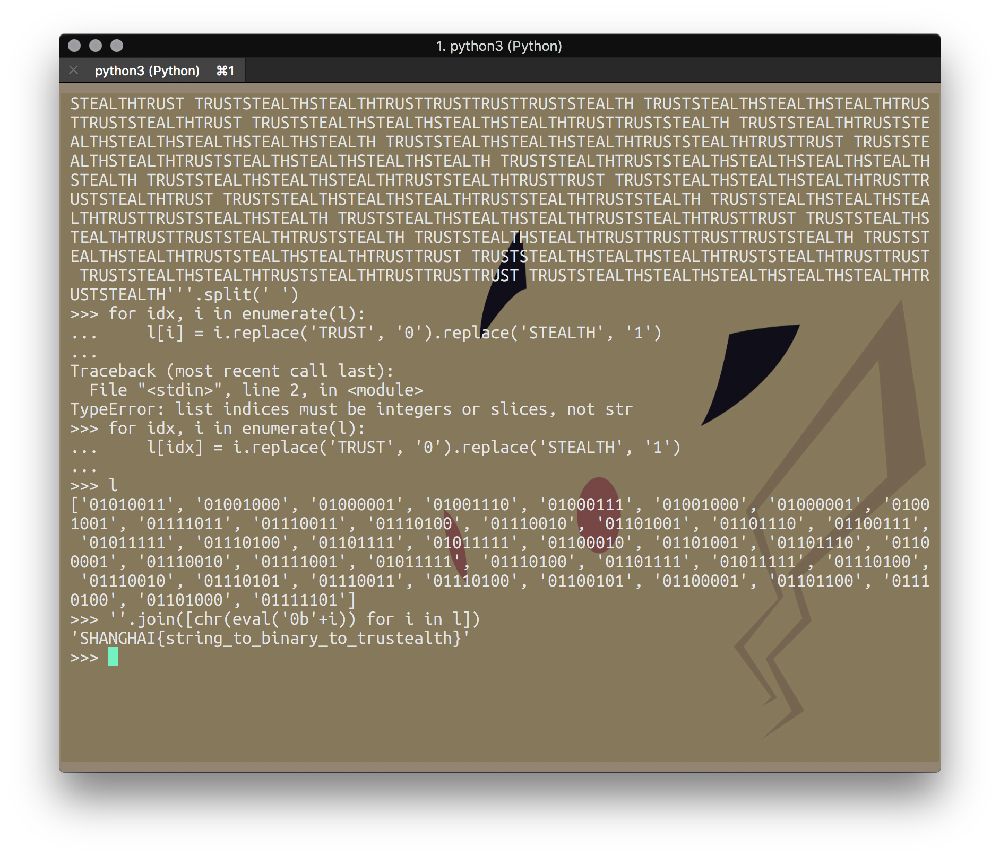
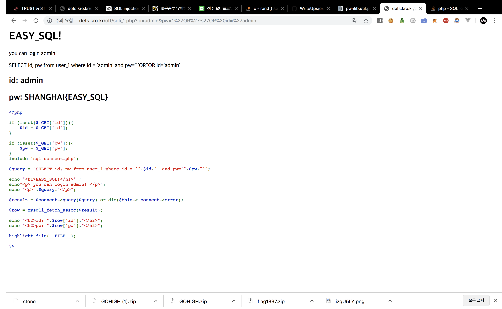

# TRUST & STEALTH Internal CTF

## MISC

### Encode our life
base85로 인코딩된 문자열 `;b02L7n>p;HVR@9?T'_n/hT15I/`이 주어진다.

`SHANGHAI{NOT_64...:(}`

### TOP SECRET

1. PPT 파일에 QR 코드가 잘려 있는데 맞추고 스캔하면 imgur 링크가 나온다.

2. 링크를 따라가면 흰색 이미지가 나오는데 간단하게 파워포인트를 사용해서 배경색을 투명하게 처리하면 숨겨진 플래그가 나온다.

`SHANGHAI{ripped_qrcode_:(}`

### TRUSTEALTH

주어진 문자열에서 `TRUST`를 0, `STEALTH`를 1로 치환하고 문자열로 바꾸면 플래그가 나온다.

`SHANGHAI{string_to_binary_to_trustealth}`

### zip1337

1. 1337번 압축된 zip파일을 준다.
2. 맥의 아카이브 유틸리티는 알아서 재귀적으로 끝까지 압축을 풀어준다.
3. 다운받아 열고 다른 거 하고 있었더니 풀려 있었다.

`SHANGHAI{zipped_flag_so_many_times}`

### Go High
QR코드 잘린 이미지들 맞추면 되는 것 같은데, 사실 압축 해제된 폴더 이름에 플래그가 노출되어 있길래 한번 집어넣어 봤더니 풀렸다.

`SHANGHAI{QRCODE!!}`

### 췍췍 MC 조정훈입니다
`SHANGHAI{잘다녀올게얘들아}`

선배님 풀 수 있게 해주셔서 감사합니다!!

## WEB

### So_Easy...

> sqli_1.php?id=admin&pw=' OR '' OR id='admin
> 
> SELECT id, pw from user_1 where id = 'admin' and pw='' OR '' OR id='admin'

`sqli_1.php?id=admin&pw=' OR '1'='1` 이걸로 넣으면 다른 데이터인 `guest`가 뜨니까 다시 한번 `id='admin'`으로 걸러주면 된다.

아니면 그 전에 뭐 넣어서 더 짧게도 됬던 듯
