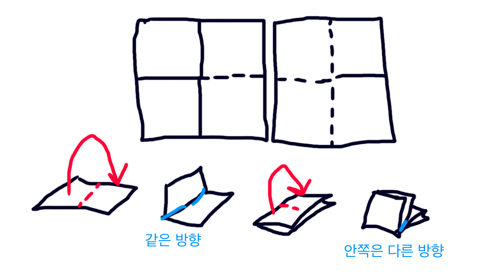
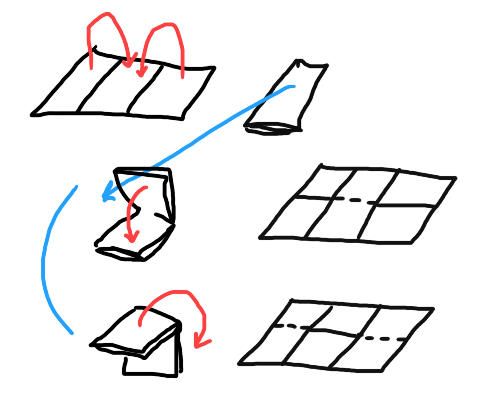

# NYPC 2018 - Day 4

## #18 피파 온라인 드리블 튜토리얼
점수 : **35** / 200

`#`의 수를 세서 출력하는 것만으로 35점을 얻을 수 있다.

## #19 종이접기
점수 : **75** / 200

점수를 주는 세 가지 경우 중 처음 두 경우를 풀었다. 실제로 종이 조각들을 접으면서 연구했다.

### 2*2 사이즈의 종이가 주어지는 경우


위 그림과 같이 위치에 상관없이 가능한 접힘은 두 가지 경우다. `(0, 0, 0, 1)`처럼 아래로 접힌 부분이 세 개고 위로 접힌 부분이 한 개인 경우, `(1, 1, 1, 0)`처럼 위로 접힌 부분이 세 개고 아래로 접힌 부분이 한 개인 경우다.

- `[].count()`는 리스트 안에 있는 해당 element의 수를 반환한다(아래 예시).

```py
list = [0, 0, 1, 0]
print(list.count(0))
# 3
```

이를 이용해서 매우 간단하게 문제를 해결할 수 있는데, 종이의 접힘 정보를 가로선/세로선 구분 없이 하나의 리스트 `folds`에 입력받고, `f(folds.count(1) is 1) or (folds.count(0) is 1)`로 다른 모든 접힘과 반대로 접힌 하나의 접힘이 있는지 확인하면 된다.

### 세로선이 모두 위로 접힌 경우


위 그림과 같이 세로로 길게 종이를 말고 그 위에서 종이를 접는 경우이다.

이 경우는 모든 가로선의 접힘이 0과 1이 반복되는 패턴으로 나타날 것이므로 이를 확인하면 된다.

제약조건이 없는 경우도 조금만 더 생각했으면 풀었을지도 모르는데, 이 경우를 대회 종료 30분 전에 푸는 바람에 시간이 부족했다.

## #20 봇 탐지
점수 : **0** / 250

도전했으나 일부 정답으로 실패했다.
