# Multimedia Forensics

- [Image Steganography](#Image-Steganography)
- [Network Packets](#Network-Packets)

## Image Steganography
데이터를 다른 데이터 사이에 삽입해 은폐하는 기술이다.

### #1. [Inception (DefCamp CTF Qualification 2017)](https://ctftime.org/task/4700)
펌웨어 분석 툴인 binwalk를 이용해서 풀이가 가능하다. 

```bash
$ brew install binwalk
```

OS X에서 binwalk를 설치하기 위해서 brew를 사용했다.


Youmaynotseeme.png라는 이름의 png 파일이 주어진다.

```bash
$ binwalk Youmaynotseeme.png

DECIMAL       HEXADECIMAL     DESCRIPTION
--------------------------------------------------------------------------------
0             0x0             PNG image, 895 x 157, 8-bit/color RGB, non-interlaced
20491         0x500B          PNG image, 895 x 157, 8-bit/color RGB, non-interlaced
40982         0xA016          PNG image, 895 x 157, 8-bit/color RGB, non-interlaced
61473         0xF021          PNG image, 895 x 157, 8-bit/color RGB, non-interlaced
81964         0x1402C         PNG image, 895 x 157, 8-bit/color RGB, non-interlaced
102455        0x19037         PNG image, 895 x 157, 8-bit/color RGB, non-interlaced
122946        0x1E042         PNG image, 876 x 159, 8-bit/color RGB, non-interlaced
123253        0x1E175         LZMA compressed data, properties: 0x91, dictionary size: 0 bytes, uncompressed size: 311519346688 bytes
123307        0x1E1AB         LZMA compressed data, properties: 0x91, dictionary size: 0 bytes, uncompressed size: 311519346688 bytes
137473        0x21901         LZMA compressed data, properties: 0x91, dictionary size: 0 bytes, uncompressed size: 311519346688 bytes
137527        0x21937         LZMA compressed data, properties: 0x91, dictionary size: 0 bytes, uncompressed size: 311519346688 bytes
148807        0x24547         PNG image, 895 x 157, 8-bit/color RGB, non-interlaced
169298        0x29552         PNG image, 895 x 157, 8-bit/color RGB, non-interlaced
189789        0x2E55D         PNG image, 895 x 157, 8-bit/color RGB, non-interlaced
210280        0x33568         PNG image, 895 x 157, 8-bit/color RGB, non-interlaced
230771        0x38573         PNG image, 895 x 157, 8-bit/color RGB, non-interlaced
251262        0x3D57E         PNG image, 895 x 157, 8-bit/color RGB, non-interlaced
```

binwalk를 이용해서 파일 안에서 여러 개의 파일 시그니처가 발견된 것을 확인할 수 있었다.

```bash
$ binwalk -D=".*" Youmaynotseeme.png
```

`-D` 또는 `--dd` 옵션을 이용해서 시그니처 스캔으로 발견된 파일들을 추출할 수 있다.

그런데 파일들이 확장자 없이 추출됬기 때문에 확인이 ~~귀찮았다~~ 어려웠다.

```bash
$ binwalk -D=".* image:png" Youmaynotseeme.png
```

[Usage](https://github.com/ReFirmLabs/binwalk/wiki/Usage#-d---ddtypeextcmd)를 보면 추출되는 파일의 저장 경로와 그 확장자 등을 설정할 수 있었다. 위와 같이 결과가 png 파일로 저장되도록 하고 실행했다.

```bash
$ tree _Youmaynotseeme.png.extracted
_Youmaynotseeme.png.extracted
├── 0.png
├── 1402C.png
├── 19037.png
├── 1E042.png
├── 24547.png
├── 29552.png
├── 2E55D.png
├── 33568.png
├── 38573.png
├── 3D57E.png
├── 500B.png
├── A016.png
└── F021.png
```

`_Youmaynotseeme.png.extracted` 폴더가 생성되고 그 아래 파일들이 생겼다.

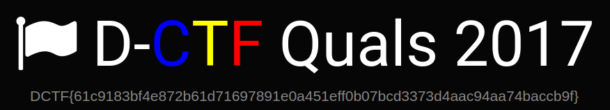

`0.png`를 포함한 다른 파일들은 주어진 파일과 일치했지만, `0x1E042`에 있었던 파일에는 플래그가 적혀 있었다.

binwalk를 돌렸을 때 이 위치의 파일은 다른 파일과 달리 사이즈가 `876 x 159`였는데, 실제 CTF 중 여러 개의 파일 시그니처가 발견된 파일의 경우 그 중 가장 unique한 결과를 먼저 살펴보는 쪽으로 하면 풀이의 효율성이 더 좋아질 것 같다.

### #2. Stego100 - Perfect Concealment (HackYou CTF 2012)
```
The giant panda (Ailuropoda melanoleuca, meaning "black and white cat-foot") is a type of bear. It lives in bamboo forests in central China. The giant panda is an endangered animal. In November 2007, China had 239 giant pandas who lived in captivity. There are 27 giant pandas which live in zoos outside of China. The exact number of giant pandas in the wild is not known. Some sources say there are about 1,590, other sources give a number between 2,000 and 3,000. The number of giant pandas in the wild seems to be increasing.
```

위와 같이 시작하는 [텍스트 파일](./prob-2/stg100.txt)이 주어진다. 

자이언트 판다에 관한 글인데, 중간 부분에 `deFend`, `bLeating`와 같이 대문자가 중간에 있는 수상한 단어들이 눈에 띈다.

파이썬으로 이런 단어를 필터링하는 [스크립트](./prob-2/exploit.py)를 짜서 돌렸다. 전체 파일에서 대문자인 글자 중 단어의 맨 앞 글자가 아닌 글자를 모으는 방식인데, 텍스트에 고유명사나 괄호 등이 있어서 필터링까지 추가해야 했다.

구글링해서 나온 [Write-Up](https://blog.w3challs.com/?post/2012/10/13/HackYou-CTF-Stego100%2C-Stego200%2C-Stego300-Writeups)을 찾아보니 정규식(`'\w\w*([A-Z])\w*'`)을 이용한 간결한 풀이가 있어서 재미있었다.

`FLAGISSEXYSTEGOPANDAS`

### #3. Stego200 - Halloween (HackYou CTF 2012)


1680 x 1050 사이즈의 png 파일이 주어진다.


dominant color가 배경색인 `(8, 8, 8)`으로 나오는데 배경을 다른 색으로 바꾸면 비밀 메세지가 나온다(PIL을 사용하려고 했는데 꼬여서 그냥 Paintbrush라는 앱을 이용했다).

```py
['0b1100001', '0b1101001', '0b1101110', '0b1110100', '0b1011111', '0b1100001', '0b1100110', '0b1110010', '0b1100001', '0b1101001', '0b1100100', '0b1011111', '0b1101111', '0b1100110', '0b1011111', '0b1101110', '0b1101111', '0b1011111', '0b1100111', '0b1101000', '0b1101111', '0b1110011', '0b1110100', '0b1110011']
```

이진수로 바꾸면 위와 같은 리스트가 나온다.

```py
>>> ''.join([chr(eval(i)) for i in list])
'aint_afraid_of_no_ghosts'
```

10진수로 바꾼 뒤 아스키코드로 출력하면 플래그가 나온다.

### 4. Spookier Kitty (Hacktober CTF)


위와 같은 jpg 파일이 주어진다.

```bash
$ strings -a -n 7 eco79u7v4kdvjpgbkz34w8xwfdi0k2ia.jpg
8xwfdi0k2ia.jpg
flag-TerrifyingKitty
EqOS*Vf
DU>&XcQ
eXF|,U&
1.cPh(4
R=nb7s0aj
><Z"o+s'w
```

`strings`로 길이 7 이상의 문자열을 뽑아보면 플래그가 나온다.

### 5. [What you see is what you get. (Pragyan CTF 2015)](https://github.com/ctfs/write-ups-2015/tree/master/pragyan-ctf-2015/stegano/what_you_see_is_what_you_get)


```bash
binwalk stego_50.jpg

DECIMAL       HEXADECIMAL     DESCRIPTION
--------------------------------------------------------------------------------
0             0x0             JPEG image data, JFIF standard 1.02
10541         0x292D          Zip archive data, at least v1.0 to extract, compressed size: 37, uncompressed size: 37, name: usethis
10720         0x29E0          End of Zip archive, footer length: 22
```

binwalk를 이용해서 파일 시그니처를 검색했다.

```bash
$ binwalk -D=".*" stego_50.jpg

WARNING: The Python LZMA module could not be found. It is *strongly* recommended that you install this module for binwalk to provide proper LZMA identification and extraction results.

WARNING: The Python LZMA module could not be found. It is *strongly* recommended that you install this module for binwalk to provide proper LZMA identification and extraction results.

DECIMAL       HEXADECIMAL     DESCRIPTION
--------------------------------------------------------------------------------
0             0x0             JPEG image data, JFIF standard 1.02
10541         0x292D          Zip archive data, at least v1.0 to extract, compressed size: 37, uncompressed size: 37, name: usethis
10720         0x29E0          End of Zip archive, footer length: 22
```

각각의 파일에 대해서 extract를 시도했다.

```bash
$ cd _stego_50.jpg.extracted
$ ls
0    292D 29E0
$ file 0
0: JPEG image data, JFIF standard 1.02, aspect ratio, density 1x1, segment length 16, baseline, precision 8, 430x425, frames 3
$ file 29E0
29E0: Zip archive data (empty)
$ file 292D
292D: Zip archive data, at least v1.0 to extract
$ unzip 29E0
Archive:  29E0
error [29E0]:  missing 179 bytes in zipfile
  (attempting to process anyway)
error [29E0]:  attempt to seek before beginning of zipfile
  (please check that you have transferred or created the zipfile in the
  appropriate BINARY mode and that you have compiled UnZip properly)
$ unzip 292D
Archive:  292D
 extracting: usethis
$ cat usethis
steghide.sourceforge.net/download.php%
```

세 가지 파일이 생겼다.

- `0`: JPEG 이미지
- `29E0`: ZIP 파일이지만 압축 해제를 시도하면 에러가 발생한다.
- `292D`: `steghide.sourceforge.net/download.php`라는 메세지가 있는 `usethis` 파일이 압축된 ZIP 파일이다.

steghide라는 툴을 이용해서 이미지에 플래그를 숨겨둔 것 같다. 

```bash
$ cat 29E0
PKMfDelta_Force\m/
```

`29E0` 파일의 내용을 출력해 보니 `Delta_Force\m/`라는 문자열이 발견됐다.

```bash
$ sudo apt-get install steghide
$ steghide extract --stegofile stego_50.jpg
Enter passphrase:
wrote extracted data to "key_stego_1".
$ cat key_stego_1
Congrats! This was way too wasy :P

This is the key:

PrAgyaNCTF_sTeg1_key
```

passphrase를 `Delta_Force\m/`로 해서 플래그를 구할 수 있었다.

### 7. keep-calm-and-ctf-100 (CSAW 2015)

> My friend sends me pictures before every ctf. He told me this one was special.
>
> Note: this flag doesn't follow the "flag{}" format

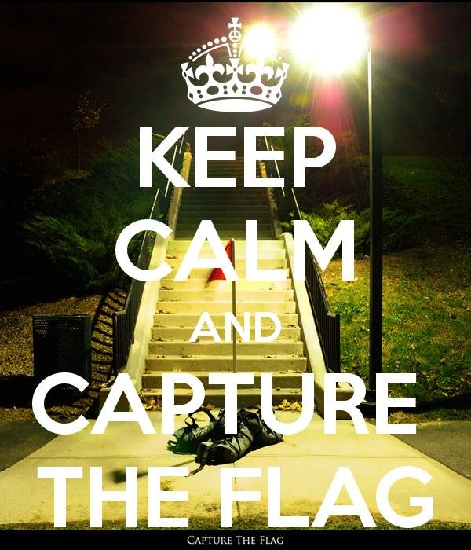


EXIF의 Copyright에 플래그가 있다.

```
$ strings -a -n 7 img.jpg
h1d1ng_in_4lm0st_pla1n_sigh7
%&'()*456789:CDEFGHIJSTUVWXYZcdefghijstuvwxyz
&'()*56789:CDEFGHIJSTUVWXYZcdefghijstuvwxyz
(...)
```

물론 strings로도 나온다.

### 9. Pixel Princess (ECTF 2014)

> Find the princess. Get the flag

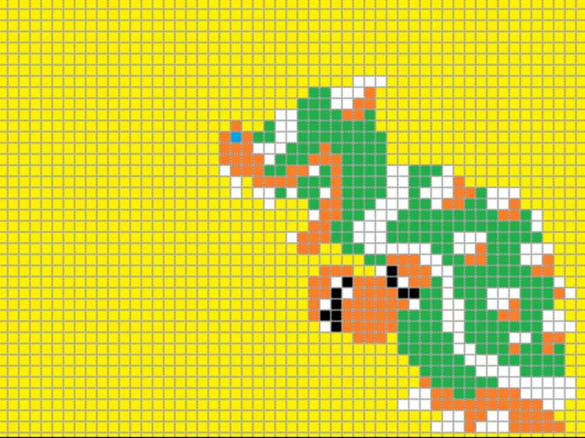

```bash
$ binwalk -D=".*" bowser.jpg 

WARNING: The Python LZMA module could not be found. It is *strongly* recommended that you install this module for binwalk to provide proper LZMA identification and extraction results.

WARNING: The Python LZMA module could not be found. It is *strongly* recommended that you install this module for binwalk to provide proper LZMA identification and extraction results.

DECIMAL       HEXADECIMAL     DESCRIPTION
--------------------------------------------------------------------------------
0             0x0             JPEG image data, JFIF standard 1.02
140981        0x226B5         Zip archive data, at least v2.0 to extract, compressed size: 41199, uncompressed size: 42877, name: MarioCastle.jpg
182338        0x2C842         End of Zip archive, footer length: 22
$ ls
0     226B5 2C842
$ file 226B5 
226B5: Zip archive data, at least v2.0 to extract
$ file 2C842 
2C842: Zip archive data (empty)
$ cat 2C842 
PKU8?%
$ unzip 226B5 
Archive:  226B5
  inflating: MarioCastle.jpg     
```

binwalk를 이용해서 `MarioCastle.jpg` 파일을 추출했다.

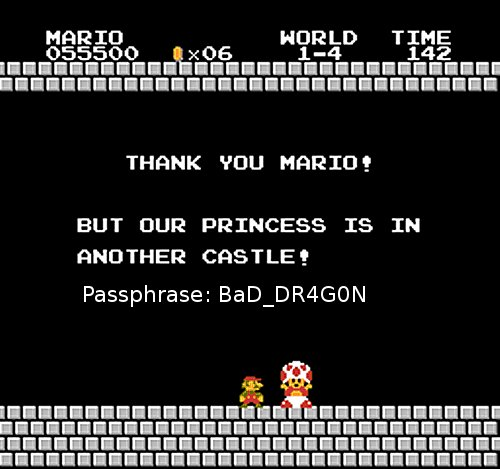

```bash
$ binwalk MarioCastle.jpg 

DECIMAL       HEXADECIMAL     DESCRIPTION
--------------------------------------------------------------------------------
0             0x0             JPEG image data, JFIF standard 1.01
```

passphrase가 `BaD_DR4G0N`이라는데 다른 파일 시그니처가 없었다.

```bash
$ steghide extract -sf MarioCastle.jpg
Enter passphrase:
steghide: could not extract any data with that passphrase!
```

steghide로 살펴봐도 마찬가지였다.

```bash
$ steghide extract -sf bowser.jpg
Enter passphrase:
wrote extracted data to "l.tar.gz".
```

`bowser.jpg`에 숨겨져 있었다. passphrase를 입력하고 추출된 파일의 압축을 푸니 플래그가 나왔다.


### 10. Wild Night Out (SwampCTF 2018)

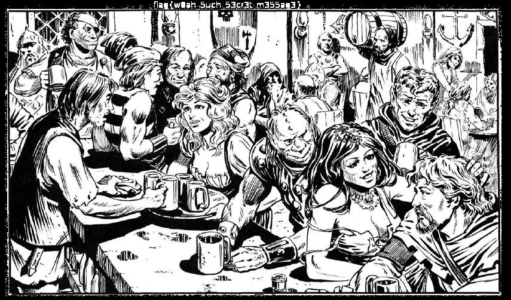

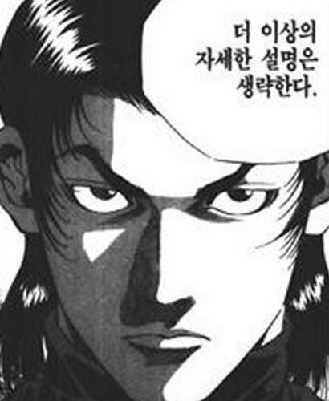

## Network Packets
네트워크 패킷

### 6. weirdShark-150 (CodeGate 2014)


주어진 패킷 파일을 와이어샤크로 로드하려고 시도하면 에러가 발생한다.

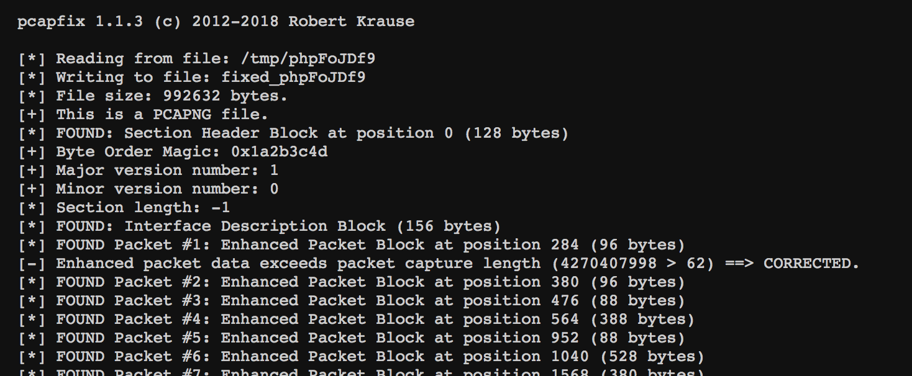

[http://f00l.de/hacking/pcapfix.php](http://f00l.de/hacking/pcapfix.php)(툴 [pcapfix](https://github.com/Rup0rt/pcapfix)의 온라인 버전)을 이용해서 `packet capture length`를 고쳤다.

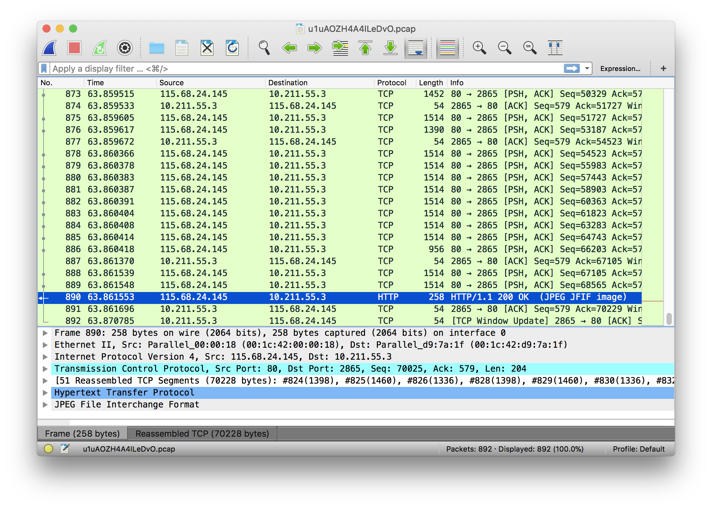

HTTP로 각종 파일을 다운로드한 흔적이 있다.

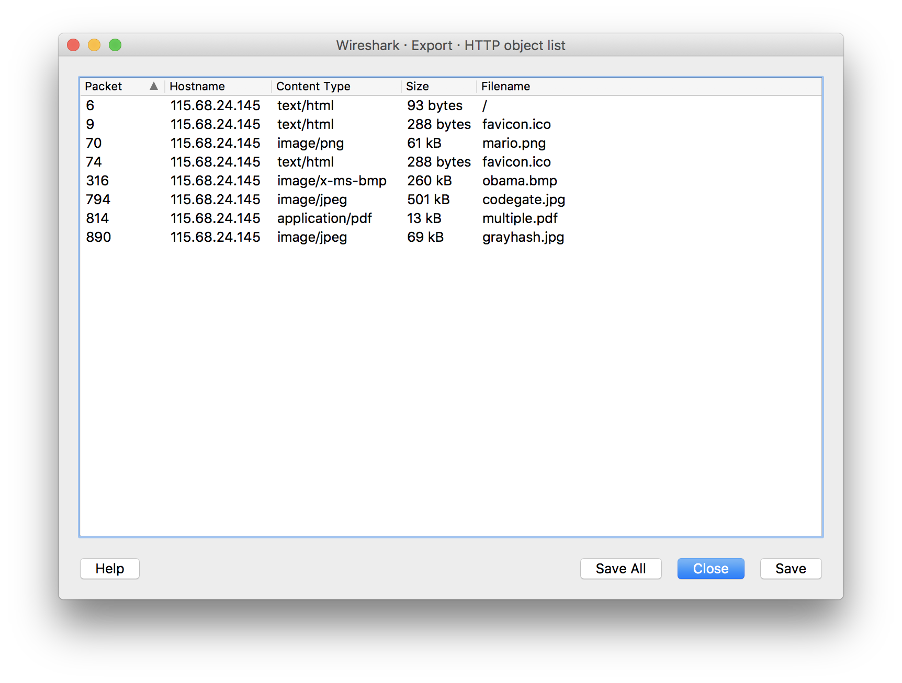

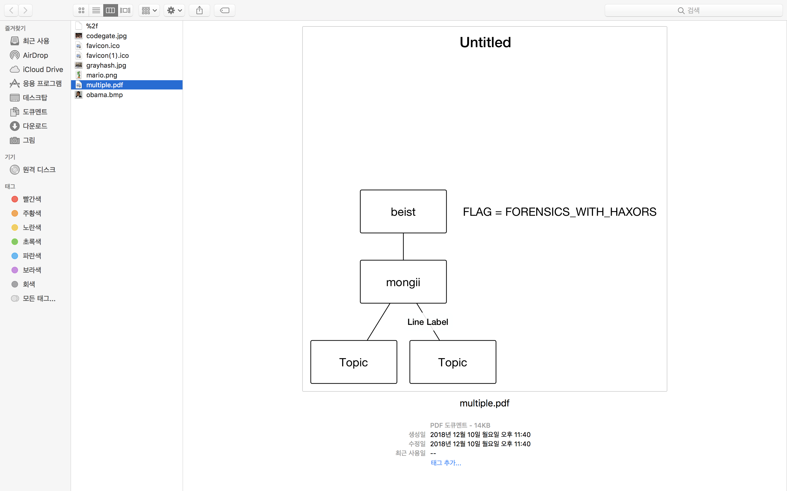

파일들을 export하고 하나씩 살펴보면 `multiple.pdf`에 플래그 `FORENSICS_WITH_HAXORS`가 있다.

### 8. transfer-100 (CSAW 2015)

```bash
$ strings net_756d631588cb0a400cc16d1848a5f0fb.pcap | grep 'flag'
FLAG = 'flag{xxxxxxxxxxxxxxxxxxxxxxxxxxxxxxxx}'
```

뭔가 있다.

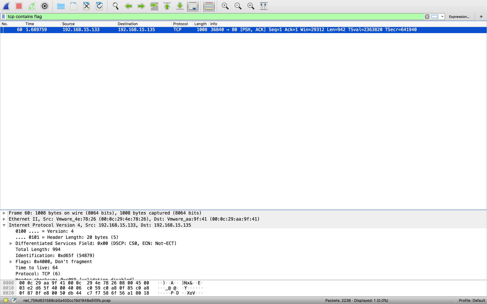

`tcp contains flag`로 필터링했다.


`Follow TCP Stream`으로 flag를 암호화해서 출력하는 파이썬 [스크립트](./prob-8/script.py)(그리고 [암호화된 flag](./prob-8/encrypted.py))를 발견할 수 있었다.

`encode` 함수를 살펴봤다.

```python
enc_ciphers = ['rot13', 'b64e', 'caesar']
# enc_ciphers는 암호화 함수 이름 목록
def encode(pt, cnt=50):
    tmp = '2{}'.format(b64encode(pt)) # 맨 처음에는 먼저 한번 base64로 하고 시작
    for cnt in xrange(cnt): # cnt번 반복
        c = random.choice(enc_ciphers) # enc_ciphers에서 함수 하나를 무작위로 골라
        i = enc_ciphers.index(c) + 1 # i는 리스트에서 고른 함수의 인덱스 + 1로 두고
        _tmp = globals()[c](tmp) # 고른 함수를 실행시킨 뒤
        tmp = '{}{}'.format(i, _tmp) # i를 앞에 두고 저장
    return tmp
# 이후 encode(FLAG, cnt=?) 호출
```

즉, 암호문의 첫 바이트(숫자)가 문자열의 다른 부분에 대한 암호화 방식을 알려주는 구조가 재귀적으로 반복되게 된다.

```python
def decode(pt, cnt):
    for i in xrange(cnt):
        c = pt[0]
        if c in ['1', '2', '3']:
          pt = globals()[dec_ciphers[int(c)-1]](pt[1:])
    return pt
print decode(enc, 100) # enc에 쓰인 cnt 값보다 크게 두면 상관없음
```

`dec_ciphers`에 저장된 각각의 함수를 구현한 뒤, decrypt하는 [스크립트](./prob-8/exploit.py)를 짜서 돌렸다.

```bash
$ python exploit.py
flag{li0ns_and_tig3rs_4nd_b34rs_0h_mi}
```
