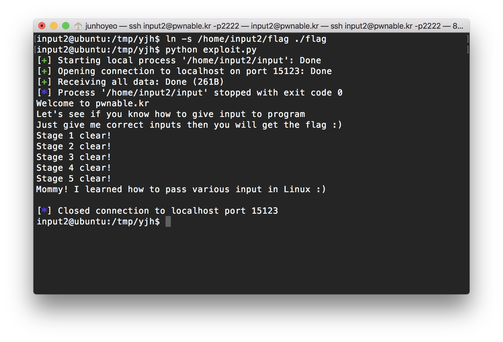

# input exploit


스테이지별 5가지 조건을 모두 충족시켜주면 된다([exploit.py](exploit.py) 참고)

다른 익스처럼 ssh 연결로 풀려고 했는데 `stderr`를 전달하기 어려워서 그냥 서버 안에서 스크립트를 아래 과정에 따라 돌렸다.

1. `/tmp` 폴더 아래에 새 폴더 `yjh`(이니셜)를 만들고 이동한다.
2. `ln -s /home/input2/flag ./flag`로 홈의 `flag` 파일에 대한 심볼릭 링크를 생성한다.
3. 익스플로잇을 작성하고 실행한다.

참고로 `remote`를 열 때 썼던 포트는 쓰고 나서 일정 시간을 대기해야 해당 포트를 다시 이용할 수 있게 되는 것 같기에(두 번 이상 연속으로 실행하면 포트를 열 수 없다면서 에러가 발생한다) 그냥 `str(randint(1000, 99999))`로 매 실행 때마다 사용하는 포트 번호를 (적당한 범위 내에서)랜덤으로 생성하여 사용하도록 작성했다.

```
input2@ubuntu:/tmp/yjh$ python exploit.py 
[+] Starting local process '/home/input2/input': Done
[+] Opening connection to localhost on port 96803: Done
[+] Receiving all data: Done (261B)
[*] Process '/home/input2/input' stopped with exit code 0
Welcome to pwnable.kr
Let's see if you know how to give input to program
Just give me correct inputs then you will get the flag :)
Stage 1 clear!
Stage 2 clear!
Stage 3 clear!
Stage 4 clear!
Stage 5 clear!
Mommy! I learned how to pass various input in Linux :)

[*] Closed connection to localhost port 96803
```
