# FTZ level1

## 설정
FTZ 이미지를 다운로드하고 가상머신에 올린다.

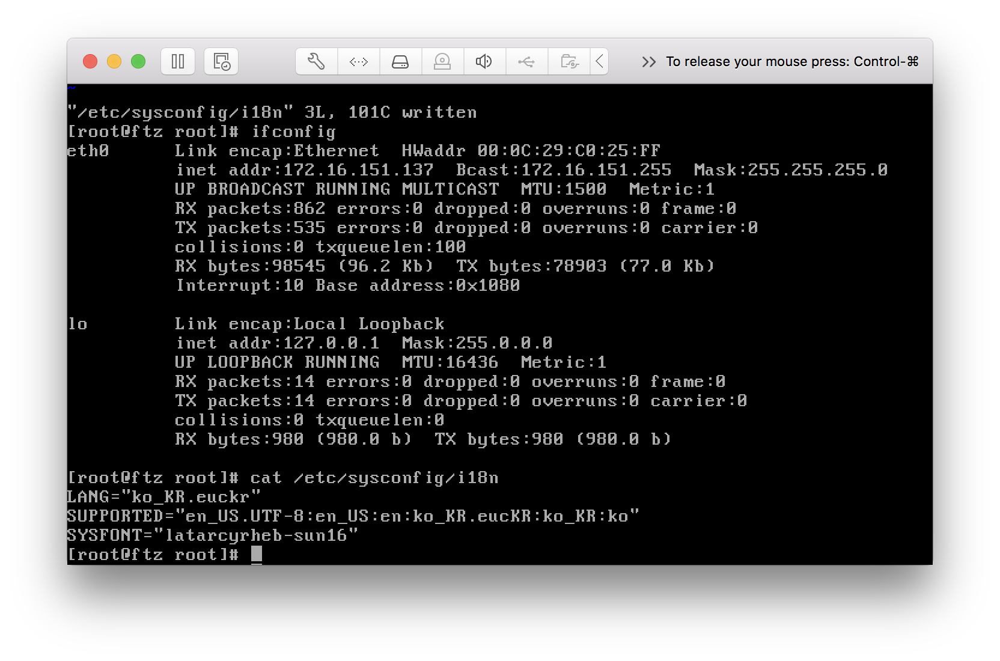

접속할 IP를 확인하고 한글이 깨지는 인코딩 문제를 해결하기 위해서 `root`:`hackerschool`로 로그인한다.

- `ifconfig` 명령어로 서버의 현재 IP 주소를 구한다. 위 스크린샷의 경우 `172.16.151.137`이였다.

- `/etc/sysconfig/i18n`의 LANG 설정을 아래와 같이 변경한다.

```diff
- LANG="en_US.UTF-8"
+ LANG="ko_KR.euckr"
SUPPORTED="en_US.UTF-8:en_US:en:ko_KR.eucKR:ko_KR:ko"
SYSFONT="latarcyrheb-sun16"
```

- OS X를 사용할 경우 터미널 환경설정에서 텍스트 인코딩을 `한국어(EUC)`로 설정해 줘야 한다. 이 설정을 유지하면 평소에 터미널을 이용할 때 내가 이용하는 쉘인 ZSH의 폰트가 깨져서 불편했기 때문에 문제를 풀 때만 켜두고 껐다.

## 접속
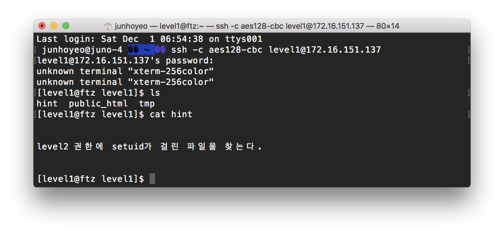

`level1`:`level1`으로 로그인하면 된다. 리눅스에서 `cat`은 파일의 내용을 출력하는 명령어이므로 이를 이용해서 `hint` 파일을 읽을 수 있다.

- `setuid`는 파일을 실행할 때 일시적으로 파일의 소유주 권한으로 실행할 수 있게 해준다. 

- 따라서 해당 파일의 소유주는 level2일 것이고, level1의 권한으로 파일을 실행하면 level2의 권한으로 임의의 명령이 실행되면서 level2의 패스워드를 구할 수 있게 될 것이다.

## find 명령어
시스템에서 파일을 찾기 위해서는 `find` 명령어를 사용하면 된다. 문제는 필자가 `level2`가 소유하고 있는 파일을 찾는 법을 잘 모른다는 것이다.

`man`은 manual(메뉴얼)의 약자로 인수로 들어온 명령어에 대한 메뉴얼을 출력해 준다. `man find`로 `find`의 옵션을 살펴보기도 했다.

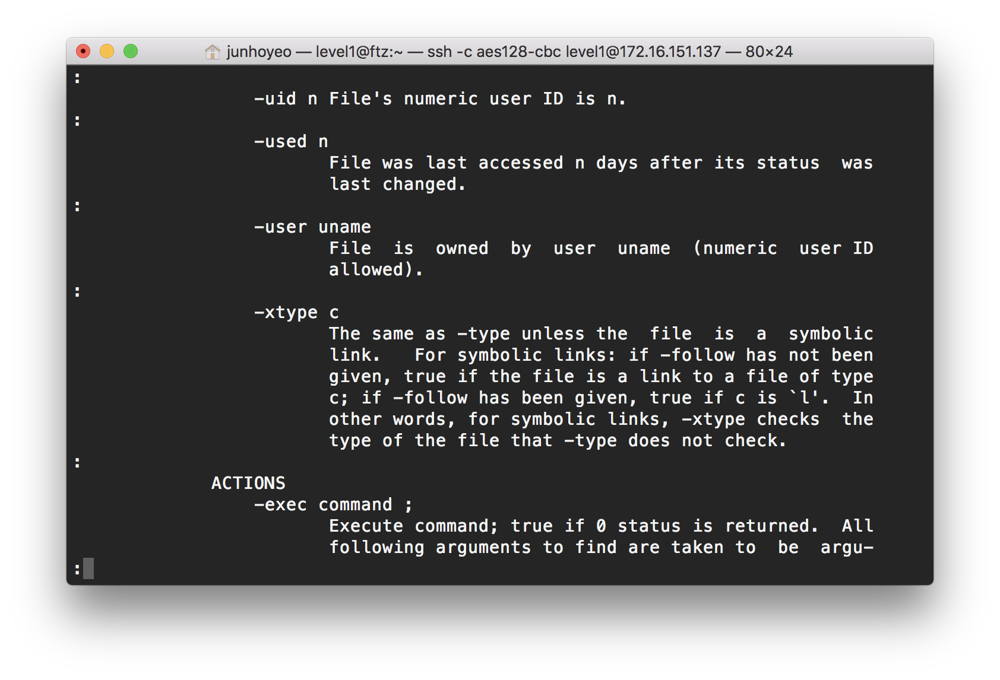

`-user {uname}` 옵션이 있다. 해당 옵션은 다음 인수로 `uname`이라는 이름의 값을 받는데, 이는 검색할 사용자의 이름 또는 사용자의 id가 될 수 있다.

따라서 우리 경우에는 `find / -user level2`를 이용할 수 있을 것이다(`/`는 디스크 전체).

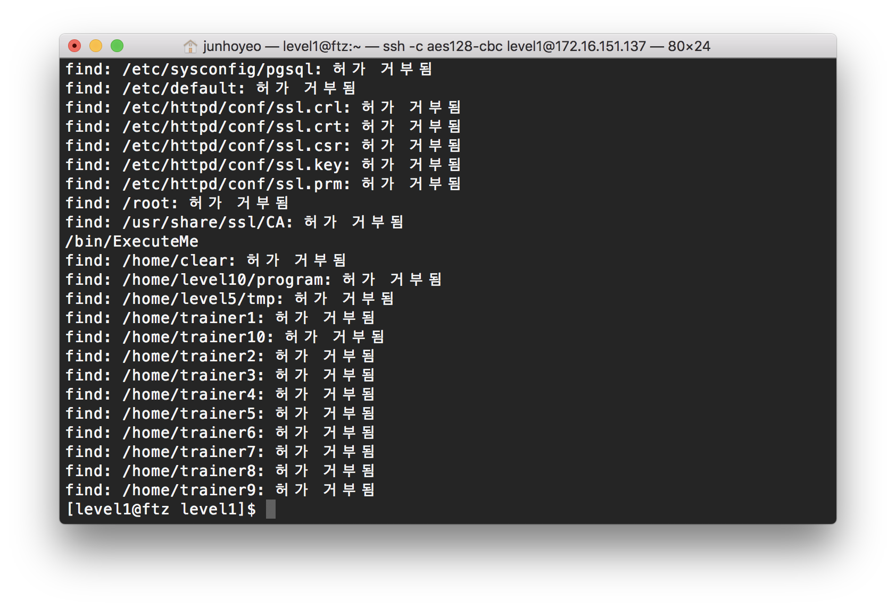

`/bin/ExecuteMe`를 제외하면 다른 파일들은 `허가 거부됨`으로 표시된다.

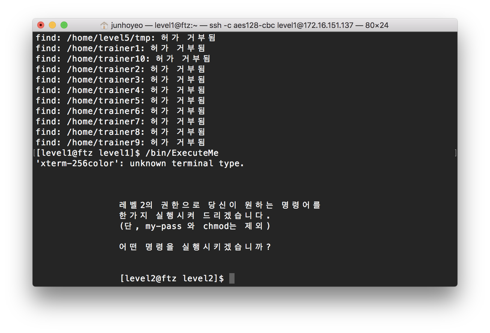

해당 파일을 실행하면 위와 같이 출력하고 입력을 대기한다.

## 패스워드 얻기

### 정석(쉘따기)

#### sh
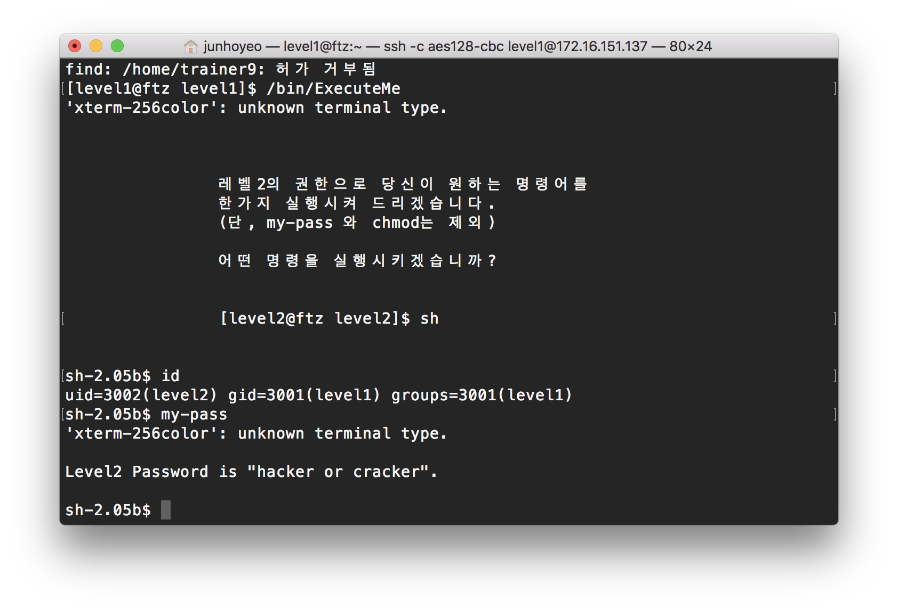
`sh`로 level2의 쉘을 얻을 수 있다.

#### bash
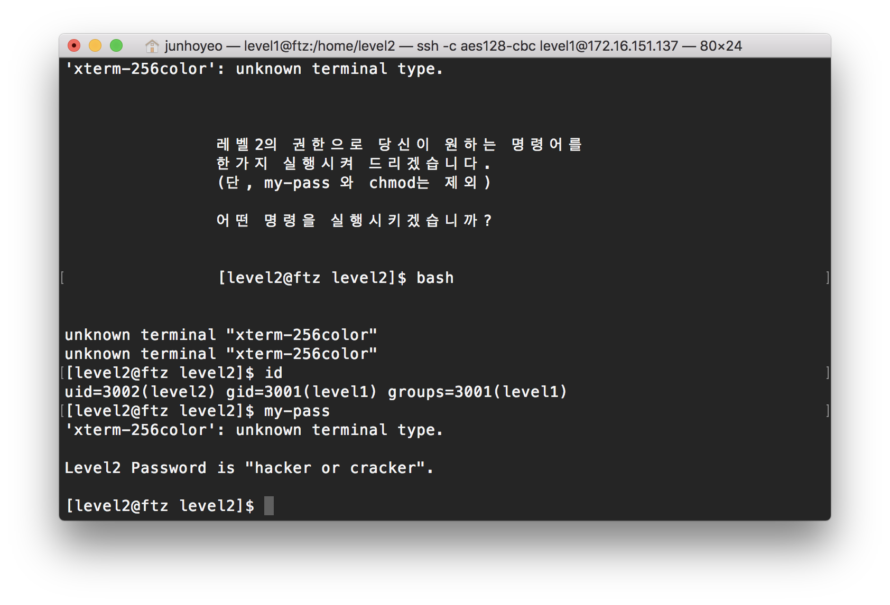
`bash`로도 level2의 배시 쉘을 얻을 수 있다.

### 필터링 우회
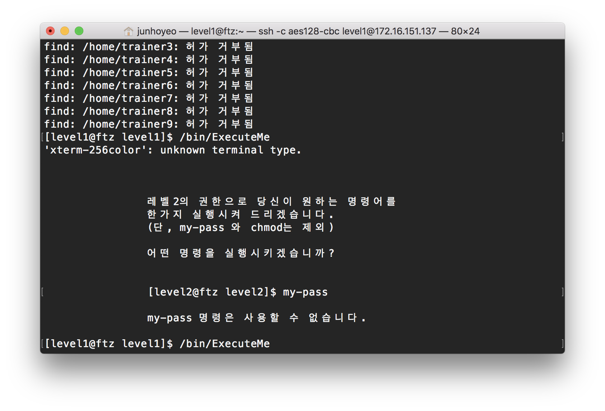

그런데 여기서 **의문점**이 하나 생긴다. 이 프로그램은 `my-pass`(그리고 `chmod`, 이하 생략)를 어떻게 필터링할까?

일단 입력받은 문자열을 단순히 `my-pass`와 비교한다고 가정하겠다(C나 PHP의 `strcmp` 함수).

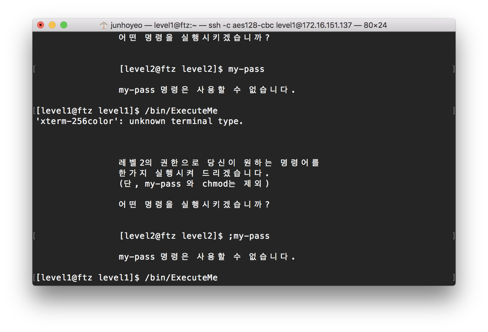

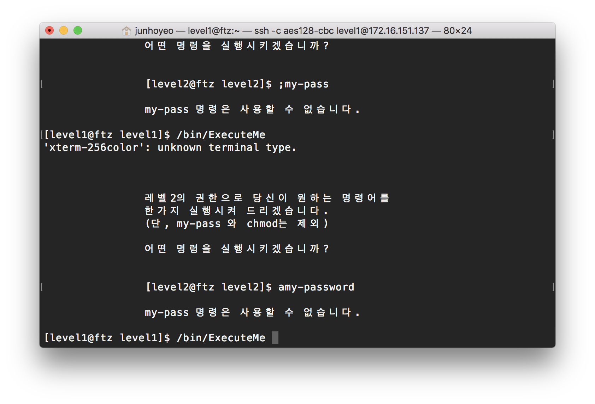

하지만 `;my-pass`와 `amy-password` 역시 필터링에 걸린다. 

이를 통해서 문자열 두 개가 단순히 같은지 확인하는 것이 아니라, `my-pass` 문자열이 입력받은 문자열에 포함되는지 확인하는 로직이 존재한다는 것을 알 수 있다(C의 `strstr`, PHP의 `strpos` 함수).

#### $1을 이용한 우회
쉘에서 `$0`, `$1`, `$2`... `$N`은 위치 매개변수이다. `$0`은 현재 실행되는 스크립트의 이름이고 `$1`부터는 스크립트의 인수를 하나씩 담고 있다. 

하지만 쉘 스크립트가 아니라 쉘에서 `echo $0` 등으로 위치 매개변수를 사용하면 그 값이 현재 실행되는 쉘의 정보가 된다. 즉 `$0`은 현재 실행되고 있는 쉘의 위치, `$1`부터는 (인수가 없으므로) 그 값이 없다.

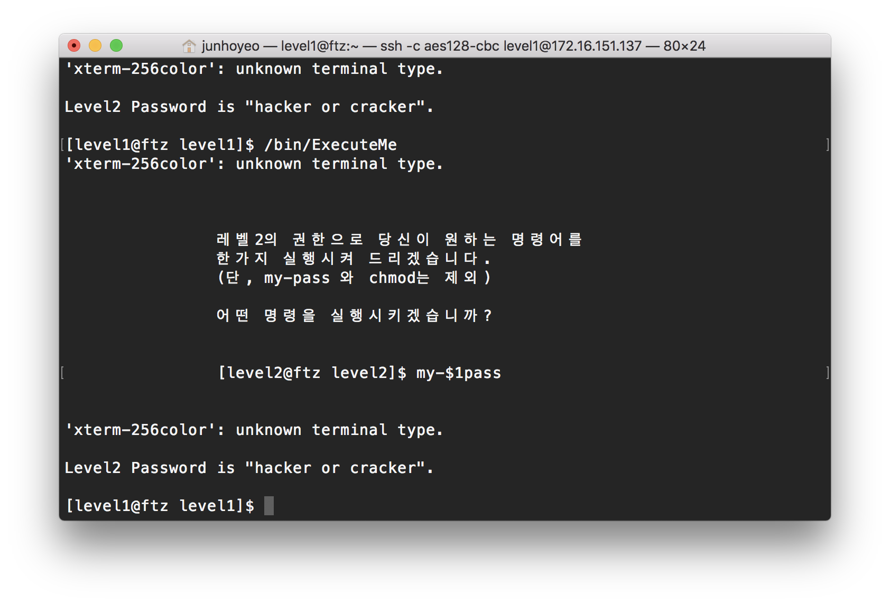

이렇게 위와 같이 중간에 `$1` 등 값이 없는 환경변수를 호출하는 것으로 입력이 필터링에 걸리지 않게 하면서도 명령어 실행에 지장이 없도록 할 수 있다.

#### ``를 이용한 우회
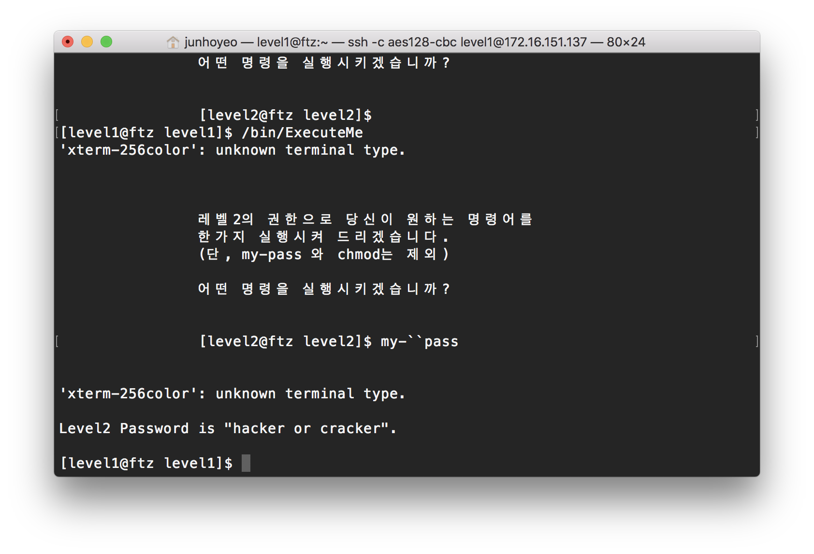

[명령어 치환](https://wiki.kldp.org/HOWTO/html/Adv-Bash-Scr-HOWTO/commandsub.html)은 명령어를 실행한 결과를 사용하게 해준다. 보통 역따옴표를 이용해서 사용되는데, 안에 아무것도 쓰지 않으면 추가되는 부분이 없으므로 우회할 수 있다.

#### $()를 이용한 우회
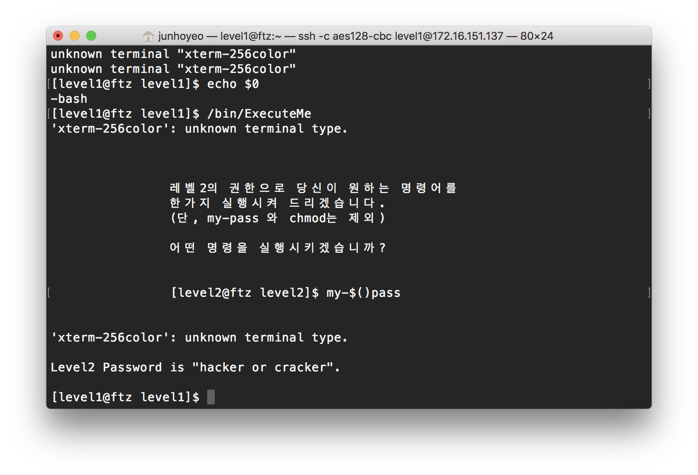

같은 방법으로 `$()`으로도 명령어 치환이 가능한데, 이 역시 우회에 사용할 수 있다.
